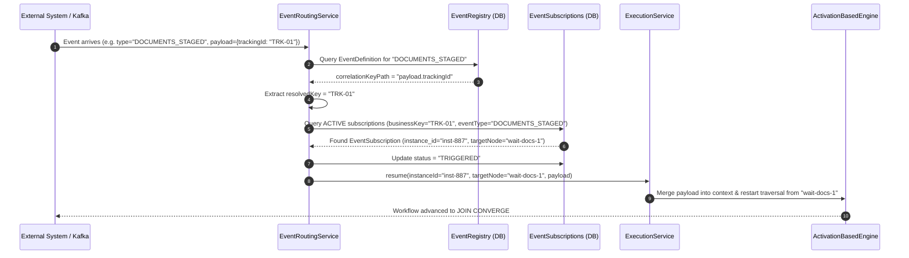

# ATLAS Workflow & Decision Platform: Deep Technical Architecture Specification

> **Audience**: AI Agent / LLM, Senior Systems Architect, Backend Engineer  
> **Document Purpose**: Complete, self-contained architectural and algorithmic specification of the **Atlas Workflow & Decision Platform**. Enables an AI system or engineer to understand, extend, debug, and trace the engine's mechanics without needing to inspect raw source files.

---

## 1. Executive Summary & Design Philosophies

The **Atlas Workflow & Decision Platform** (`vth-workflow-service` / `vth-workflow-ui`) is an enterprise-grade, high-throughput, event-driven state machine and DAG (Directed Acyclic Graph) orchestration engine. It is tailored for complex telecommunication and enterprise transactional journeys (e.g., Customer Acquisition Form [CAF] processing, SIM activation, KYC document verification, and credit approvals).

### Foundational Principles:
1. **Java 21+ Virtual Threads (Project Loom)**: Replaces traditional thread pools with lightweight virtual threads (`Executors.newVirtualThreadPerTaskExecutor()`). Long-running wait states or external I/O operations do not block operating system platform threads.
2. **Zero Engine-UUID Leaks to External Systems (Domain-Key Correlation)**: External systems (Kafka producers, document scanners, payment gateways) interact using domain identifiers (**`businessKey`**, e.g., `CAF12345`, `trackingId`, `orderId`). They never know or store internal workflow engine UUIDs.
3. **Dual Execution Engine Paradigms**:
   - **`ActivationBasedEngine`**: A Petri-net/token activation model designed for structural DAGs with parallel splits, asynchronous forks, and join convergences (`AND` / `OR`).
   - **`SequentialEngine`**: A depth-first traversal engine designed for strictly linear or tree-based pipelines.
4. **Compile-Once, Traverse-Fast Graph Caching**: Raw JSON workflow definitions are compiled into memory-efficient, indexed graph topologies (`CompiledWorkflowGraph`) containing pre-indexed outgoing/incoming edge lookups, topological sorting, and pre-parsed SpEL expressions.
5. **Decoupled Vertical Partitioning**: High-frequency summary telemetry (`workflow_execution_logs`) is physically separated from heavy payload dumps (`workflow_execution_log_details` storing megabyte-scale JSON traces and input contexts in dedicated CLOB partitions) to protect query throughput.

---

## 2. Complete Domain Entities & Relational Data Model

All tables share the prefix `workflow_` to prevent namespace collisions in enterprise shared schemas (Oracle 19c / PostgreSQL).

```
                      +----------------------+
                      | workflow_definitions |
                      +----------+-----------+
                                 | 1
                                 |
                                 | *
                       +---------v---------+
                       | workflow_versions |
                       +---+---------+-----+
                           |         |
           +---------------+         +---------------+
           | 1                                       | 1
           |                                         |
           | *                                       | *
+----------v----------+                   +----------v---------------+
|  workflow_instances |                   | workflow_execution_logs  |
+----+------+------+--+                   +------------+-------------+
     |      |      |                                   | 1 (MapsId)
     | 1    | 1    | 1                                 |
     |      |      |                                   | 1
     | *    | *    | *                    +------------v-------------------+
     |      |      +--------------------->| workflow_execution_log_details |
     |      |                             +--------------------------------+
     |      +--------------------+
     |                           |
+----v--------------------+ +----v--------------------------+
| workflow_task_instances | | workflow_event_subscriptions  |
+-------------------------+ +-------------------------------+
```

### Table Specifications:

#### 1. `workflow_definitions`
* **Purpose**: Metadata root representing a logical workflow journey.
* **Columns**:
  * `workflow_definition_pk` (VARCHAR2(36), PK): UUID.
  * `wf_key` (VARCHAR2(100), UNIQUE): Machine name (e.g. `caf-submission-orchestrator`).
  * `name` (VARCHAR2(255)): Display title.
  * `description` (VARCHAR2(1000)): Journey description.
  * `active_version` (NUMBER(10)): Pointer to current published version number.
  * `active` (NUMBER(1), DEFAULT 1): Active flag.
  * `circle_id` (NUMBER(10)): Multi-tenant or regional circle boundary identifier.

#### 2. `workflow_versions`
* **Purpose**: Immutable versioned release of a workflow graph structure.
* **Columns**:
  * `workflow_version_pk` (VARCHAR2(36), PK): UUID.
  * `workflow_definition_id` (VARCHAR2(36), FK $\to$ `workflow_definitions.workflow_definition_pk` ON DELETE CASCADE).
  * `version` (NUMBER(10)): Version integer (1, 2, 3...). Unique per `(workflow_definition_id, version)`.
  * `status` (VARCHAR2(20)): `DRAFT`, `REVIEW`, `APPROVED`, `PUBLISHED`, `DEPRECATED`.
  * `definition_json` (CLOB): Full React-Flow compatible graph containing array of `nodes` and `edges`.

#### 3. `workflow_instances`
* **Purpose**: Runtime execution state of a specific journey run.
* **Columns**:
  * `workflow_instance_pk` (VARCHAR2(36), PK): Runtime instance UUID.
  * `workflow_key` (VARCHAR2(100)): Copied from definition for fast lookup.
  * `version_id` (VARCHAR2(36), FK $\to$ `workflow_versions.workflow_version_pk`).
  * `version_number` (NUMBER(10)): Exact graph version executing.
  * `business_key` (VARCHAR2(100), INDEXED): The external correlation identifier (e.g. `TRK-2026-9901`).
  * `status` (VARCHAR2(30)): `CREATED`, `RUNNING`, `WAITING`, `COMPLETED`, `FAILED`, `TERMINATED`.
  * `current_node_id` (VARCHAR2(100)): ID of node currently executing or waiting.
  * `opt_lock_version` (NUMBER(19), DEFAULT 0): JPA `@Version` optimistic concurrency lock.
  * `serialized_context` (CLOB): Complete runtime variable scope as a JSON map (`Map<String, Object>`).
  * `runtime_graph` (CLOB): Active tokens, active nodes, and traversed edge IDs (used by `ActivationBasedEngine`).

#### 4. `workflow_task_instances`
* **Purpose**: Audit step ledger of every node execution attempt within an instance.
* **Columns**:
  * `task_instance_pk` (VARCHAR2(255), PK): Formatted as `{instance_id}_{nodeId}_{counter}`.
  * `instance_id` (VARCHAR2(36), FK $\to$ `workflow_instances.workflow_instance_pk` ON DELETE CASCADE).
  * `task_type` (VARCHAR2(50)): `RULE`, `COMMAND`, `WAIT_EVENT`, `BUCKET`, etc.
  * `label` (VARCHAR2(200)): Node label.
  * `status` (VARCHAR2(30)): `WAITING`, `COMPLETED`, `FAILED`, `SKIPPED`.
  * `input_data` (CLOB): Input snapshot.
  * `output_data` (CLOB): Step results snapshot.
  * `started_at` / `completed_at` (TIMESTAMP).

#### 5. `workflow_event_subscriptions`
* **Purpose**: Active correlation listeners waiting for external signals.
* **Columns**:
  * `event_subscription_pk` (VARCHAR2(36), PK): Subscription UUID.
  * `instance_id` (VARCHAR2(36), FK $\to$ `workflow_instances.workflow_instance_pk` ON DELETE CASCADE).
  * `business_key` (VARCHAR2(100), INDEXED): The domain business identifier.
  * `event_type` (VARCHAR2(100), INDEXED): Expected event name (e.g. `DOCUMENTS_STAGED`).
  * `target_node_id` (VARCHAR2(100)): Graph node to resume when triggered.
  * `status` (VARCHAR2(30), DEFAULT 'ACTIVE'): `ACTIVE`, `TRIGGERED`, `CANCELLED`.
  * `filter_attributes` (CLOB): Key-value criteria JSON for selective matching.

#### 6. `workflow_execution_logs` & `workflow_execution_log_details` (Vertical Partitioning)
* **Design Pattern**: 1-to-1 vertical partitioning via JPA `@MapsId`.
* **`workflow_execution_logs`**: Summary row containing `execution_log_pk`, `workflow_key`, `instance_id`, `status`, `step_count`, `duration_ms`, `started_at`, `completed_at`.
* **`workflow_execution_log_details`**:
  * `log_id` (VARCHAR2(36), PK and FK $\to$ `workflow_execution_logs.execution_log_pk` ON DELETE CASCADE).
  * `input_context_json` (CLOB): Deep copy of initial parameters.
  * `execution_trace_json` (CLOB): Full step-by-step audit trail array.

#### 7. Supporting Catalog & Domain Tables
* **`workflow_event_definitions`**: Catalog of registered event types, their Kafka topics, payload schemas, and **`correlation_key_path`** (e.g. `payload.trackingId`).
* **`workflow_buckets` & `workflow_bucket_executions`**: Human-in-the-loop task queues, SLAs, assignment groups, and resolution states (`APPROVED`, `REJECTED`, `PARKED`).
* **`workflow_rules`**: Reusable SpEL business rules with SpEL expressions.
* **`workflow_context_schemas` & `workflow_context_fields`**: Data dictionary specifying type constraints and REST/DB context providers.
* **`workflow_integration_registry`**: Configurations for outbound REST, DB, and MQ integrations.
* **`workflow_staged_payloads`**: Temporary staging table enabling out-of-order API arrivals before or during workflow execution.

---

## 3. Engine Architecture & Concurrency Mechanics

```
                  +-----------------------------------+
                  |  ExecutionService.execute()       |
                  +-----------------+-----------------+
                                    |
                                    v
                  +-----------------------------------+
                  |  CompiledWorkflowGraph (Cache)    |
                  +-----------------+-----------------+
                                    |
                    +---------------+---------------+
                    | (Fork to Virtual Thread)      |
                    v                               v
        +-----------------------+       +-----------------------+
        | SequentialEngine      |       | ActivationBasedEngine |
        | (Linear / Tree Flows) |       | (DAG / Parallel Fork) |
        +-----------------------+       +-----------------------+
```

### Graph Compilation & Memory Topology
When a workflow version is published or first accessed, the engine compiles the raw JSON into an immutable `CompiledWorkflowGraph`:
* **Node Indexing**: `Map<String, WorkflowNodeDto>` (`nodeMap`) provides $O(1)$ node lookup by ID.
* **Adjacency Lists**:
  * `Map<String, List<WorkflowEdgeDto>>` (`outgoingEdges`): Edges originating from a node.
  * `Map<String, List<WorkflowEdgeDto>>` (`incomingEdges`): Edges targeting a node.
* **Edge Validation & Expression Parsing**: Conditional SpEL expressions on edges (`#context['amount'] > 500`) are verified and pre-parsed using Spring's `SpelExpressionParser`.

### Concurrency Model (Project Loom)
Execution runs inside virtual threads provided by `workflowVirtualTaskExecutor` (`Executors.newVirtualThreadPerTaskExecutor()`).
* Thread allocation cost is near-zero (a few hundred bytes).
* When a node halts in a `WAIT_EVENT` or `BUCKET`, the thread completes its transaction, commits context and state to the database, and exits cleanly. No platform OS thread is blocked while waiting for asynchronous Kafka signals or human operator action.

---

## 4. Node Types & Execution Lifecycle

Every node in the graph extends the execution contract:
```java
NodeExecutionResult execute(WorkflowNodeDto node, TraversalExecutionState state, StepRecordDto step, List<StepRecordDto> trace);
```

### Supported Node Types:

| Node Type | Behavior & Purpose | Frontier / Resumption Semantics |
| :--- | :--- | :--- |
| **`START`** | Workflow entry point. Validates initial input against `ContextSchema`. | Advances to all outgoing target nodes. |
| **`END`** | Workflow terminal node. Marks instance `COMPLETED` and computes final duration. | Terminates the active branch. |
| **`RULE`** | Evaluates a SpEL expression or executes a catalog rule. Sets result in context. | Evaluates outgoing edge SpEL conditions to select the next path. |
| **`DECISION`** | Multi-way conditional branch. Evaluates edge SpEL conditions sequentially. | Routes execution down the first edge whose condition evaluates to `true`. |
| **`PARALLEL` (Fork)** | Structural parallel split. Activates all outgoing branches concurrently. | Pushes all outgoing nodes into the active execution frontier. |
| **`JOIN` (Converge)** | Synchronization gateway. Checks if all incoming branches have traversed. | **Structural AND**: Checks `state.activeEdges`. If any incoming edge is not traversed, status remains `WAITING` without advancing. Once all branches arrive, advances downstream. |
| **`COMMAND`** | Pluggable automated actions (REST call, DB write, Kafka publish, child workflow). | Executes synchronous command strategy; maps output back to context; advances. |
| **`WAIT_EVENT`** | Asynchronous suspension listener. Registers `EventSubscription` row. | **Suspends thread**. Marks instance `WAITING`. Resumes only upon incoming correlated event. |
| **`BUCKET`** | Human task queue. Creates `BucketExecution` row and publishes Kafka event. | **Suspends thread**. Resumes when operator resolves bucket (`APPROVED`/`REJECTED`). |
| **`SUB_WORKFLOW`** | Call Activity. Triggers child workflow and registers subscription for completion. | **Suspends thread** until child instance reaches `COMPLETED` or `FAILED`. |
| **`TIMER`** | Delay node. Computes future timestamp and schedules delayed resumption. | Halts until specified duration expires. |

---

## 5. The Command System Strategy Pattern

Automated external integrations are encapsulated behind the `WorkflowCommand` interface:

```java
public interface WorkflowCommand {
    String getCommandType();
    Map<String, Object> execute(Map<String, Object> input) throws Exception;
}
```

Registered strategies managed by Spring's `CommandRegistry`:
1. **`HttpRestCommand` / `REST`**:
   - Resolves target URL, HTTP Method (GET, POST, PUT, DELETE), headers, and timeout.
   - Evaluates SpEL `inputMapping` against context to build JSON request body.
   - Evaluates `outputMapping` to map response payload attributes back into workflow context.
2. **`MqPublishCommand` / `MQ`**:
   - Publishes JSON message to configured Kafka broker topic using Spring `KafkaTemplate`.
3. **`CreateBucketCommand`**:
   - Programmatically registers a human review workload row.
4. **`UpdateFormStatusCommand`**:
   - Updates status of customer golden records in `workflow_customer_forms`.
5. **`StartChildWorkflowCommand`**:
   - Boots child workflow instance asynchronously with isolated parameter scope.
6. **`EmitEventCommand`**:
   - Dispatches a workflow event internally or to Kafka to trigger other waiting workflows.

---

## 6. Event Correlation & Asynchronous Resumption

The most critical capability of the platform is matching external inbound messages to suspended workflow instances without requiring internal instance IDs.



### Correlation Key Resolution Logic:
1. **Top-Level `businessKey`**: If event JSON has `"businessKey": "TRK-100"`, use it directly.
2. **Dynamic Path Extraction**: If configured in `workflow_event_definitions` (e.g. `correlationKeyPath = "payload.documents.trackingId"`), the engine evaluates the JSON path against the payload to resolve the key.
3. **Database Match**:
   ```sql
   SELECT * FROM workflow_event_subscriptions 
   WHERE business_key = :resolvedKey 
     AND event_type = :eventType 
     AND status = 'ACTIVE';
   ```
4. **Resumption**:
   - Associated `TaskInstance` is marked `COMPLETED` with event payload as output data.
   - Subscription marked `TRIGGERED`.
   - Workflow instance status transitions from `WAITING` to `RUNNING`.
   - Engine evaluates outgoing edges of the `WAIT_EVENT` node and resumes traversal.

---

## 7. Out-of-Order Staging (Start-or-Correlate Pattern)

In telecom CAF journeys, external APIs and callbacks frequently arrive out of order (e.g., Document Scanner uploads before the customer submission API, or CAF metadata arrives before Document upload).

The platform solves this via **`CafJourneyIngestionService`** and **`StagedPayload`**:
* **Step 1**: Inbound payload is saved in `workflow_staged_payloads` (`status = 'STAGED'`).
* **Step 2 (Start-or-Correlate)**:
  - If a workflow instance already exists for the `businessKey`: The service routes the event directly to advance the existing workflow.
  - If NO workflow instance exists yet: It initializes a new workflow instance with the current payload as initial context.
* **Step 3**: When subsequent stages arrive, they correlate and trigger the parallel waiting nodes, advancing the graph to the `JOIN CONVERGE` node.

---

## 8. Variable Scoping & SpEL Evaluation

Workflow context is stored as a nested key-value map (`Map<String, Object>`).

### SpEL Expression Rules:
* Expressions use `#context` variable or direct map access:
  * `#context['requiresApproval'] == true`
  * `#context['amount'] > 1000`
  * `#context['lastOutcome'] == 'APPROVED'`
  * `#context['docsReady'] && #context['cafReady']`
* Edge conditions with blank/null expressions default to unconditional `true`.
* If multiple outgoing conditional edges evaluate to `true`, `ActivationBasedEngine` treats them as parallel paths, whereas `SequentialEngine` follows the first matching edge.

---

## 9. API Specifications & Interaction Endpoints

### 1. Execute / Start Workflow
* **Endpoint**: `POST /api/workflows/{workflowKey}/execute`
* **Request Body**:
  ```json
  {
    "businessKey": "TRK-2026-001",
    "contextId": "TRK-2026-001",
    "circleId": 101,
    "context": {
      "customerName": "John Doe",
      "requestedPlan": "PREPAID_5G",
      "amount": 299
    }
  }
  ```
* **Response**:
  ```json
  {
    "instanceId": "3fa85f64-5717-4562-b3fc-2c963f66afa6",
    "workflowKey": "caf-submission-orchestrator",
    "status": "WAITING",
    "stepCount": 4,
    "durationMs": 38
  }
  ```

### 2. Inbound Event Ingestion / Webhook
* **Endpoint**: `POST /api/events`
* **Request Body**:
  ```json
  {
    "eventId": "evt-7712",
    "eventType": "DOCUMENTS_STAGED",
    "businessKey": "TRK-2026-001",
    "payload": {
      "trackingId": "TRK-2026-001",
      "documentType": "PASSPORT",
      "verificationStatus": "VERIFIED",
      "docsReady": true
    }
  }
  ```
* **Response**: `200 OK` (triggers immediate synchronous or background resumption).

### 3. Human Bucket Task Resolution
* **Endpoint**: `POST /api/buckets/resolve`
* **Request Body**:
  ```json
  {
    "bucketExecutionId": "bex-1092",
    "outcome": "APPROVED",
    "operatorId": "ADMIN_USER_4",
    "resolutionNotes": "Verified photo against identity records",
    "additionalContext": {
      "approvalCode": "APP-998"
    }
  }
  ```
* **Response**: `200 OK` (resumes workflow with `#context['lastOutcome'] = 'APPROVED'`).

---

## 10. Frontend Architecture (`vth-workflow-ui`)

* **Framework**: React 19, Vite, Material UI (MUI v9), Lucide React.
* **Canvas Engine**: `@xyflow/react` (React Flow v12).
* **Key Components**:
  * `DesignerCanvas.jsx`: Interactive drag-and-drop node graph canvas.
  * `NodePropertiesDrawer.jsx`: Context-aware configuration drawer for each node type (Dropdown integration with Event Registry, Bucket Registry, Rule Catalog).
  * `ExecutionReplayPage.jsx`: Visual execution replay highlighting traversed edges with glowing stroke animations, node status badges (`WAITING`, `COMPLETED`, `FAILED`), and live context inspector.
  * `EventRegistryPage.jsx`: Event catalog management with a built-in **Simulation Tool (Play ▶)** to simulate Kafka/REST events directly from the UI.
