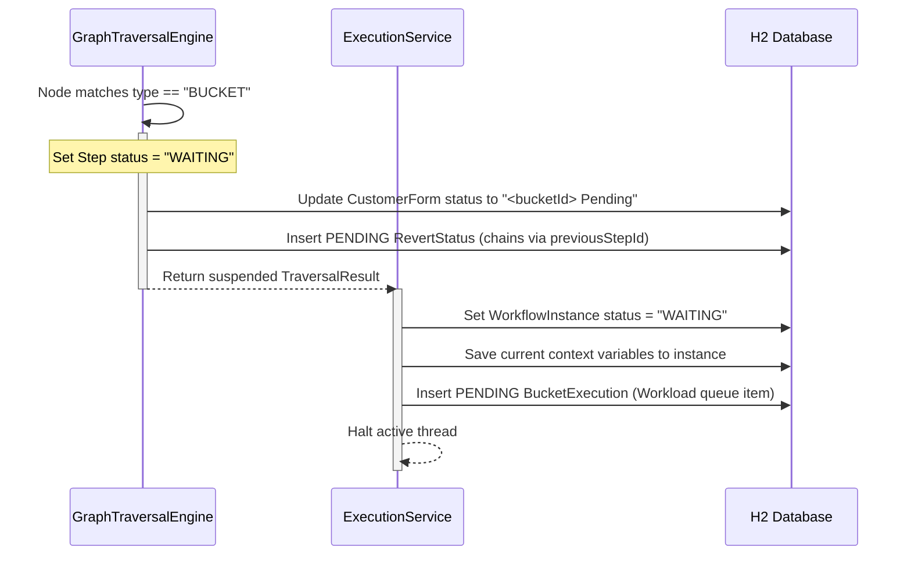
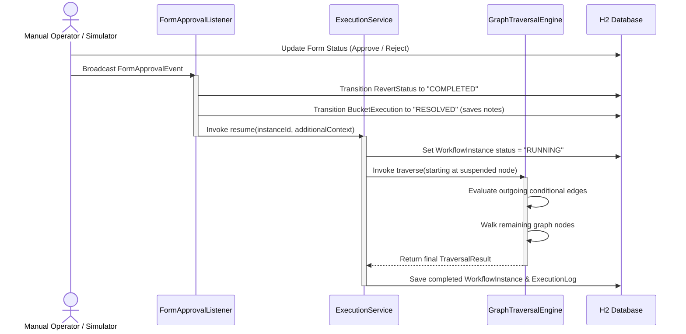

# Buckets & Outcomes Backend Architecture

This document describes how the human-in-the-loop task queues (referred to as **Buckets** or **Outcomes**) are designed and executed in the project's Spring Boot backend.

---

## 1. Database Schema & Entity Modeling

The manual processing logic relies on three core JPA entities:

*   **`Bucket`** ([Bucket.java](file:///c:/Users/hemant/Desktop/Projects/state-machine-engine/atlas-workflow-service/src/main/java/com/enterprise/atlas/workflow/entity/Bucket.java)):
    Defines the static metadata for validation queues.
    *   `bucketId`: Unique business key (e.g. `OBCC`, `FOIR`).
    *   `priority`: Urgency tier (`CRITICAL`, `HIGH`, `MEDIUM`, `LOW`).
    *   `slaHours`: Time limit before SLA is breached.
    *   `ownerGroup`: Responsible operations team.
*   **`BucketExecution`** ([BucketExecution.java](file:///c:/Users/hemant/Desktop/Projects/state-machine-engine/atlas-workflow-service/src/main/java/com/enterprise/atlas/workflow/entity/BucketExecution.java)):
    Represents an active or resolved workload item in the queue.
    *   `instanceId`: Associates the workload item with the parent workflow execution.
    *   `status`: Current state (`PENDING`, `IN_REVIEW`, `RESOLVED`).
    *   `slaBreached`: Flag calculated dynamically on query (if elapsed time > SLA hours).
*   **`RevertStatus`** ([RevertStatus.java](file:///c:/Users/hemant/Desktop/Projects/state-machine-engine/atlas-workflow-service/src/main/java/com/enterprise/atlas/workflow/entity/RevertStatus.java)):
    Provides an audit timeline of manual stages. Revert steps are linked sequentially (via `previousStepId`) to reconstruct the complete chronological manual progression.

---

## 2. Execution & Traversal Flow

The graph traversal engine processes the pipeline definition node-by-node. Below is the sequence when a workflow execution encounters a bucket.

### Detailed Steps:
1.  **Encountering the Node**: The [GraphTraversalEngine.java](file:///c:/Users/hemant/Desktop/Projects/state-machine-engine/atlas-workflow-service/src/main/java/com/enterprise/atlas/workflow/service/GraphTraversalEngine.java) detects `node.getType() == "BUCKET"`.
2.  **Updating Form & Revert Registry**:
    *   The engine looks up the `CustomerForm` based on the context's `formId` and sets its status to `"<bucketId> Pending"` (e.g. `OBCC Pending`).
    *   It creates a `RevertStatus` record in the `PENDING` state and links it to any previously completed revert steps.
3.  **Halting Thread & Creating Queue Item**:
    *   The engine stops walking and returns a suspended result.
    *   The [ExecutionService.java](file:///c:/Users/hemant/Desktop/Projects/state-machine-engine/atlas-workflow-service/src/main/java/com/enterprise/atlas/workflow/service/ExecutionService.java) commits the current variables to the database, transitions the parent `WorkflowInstance` and `ExecutionLog` states to `WAITING`, and auto-creates a pending `BucketExecution` workload record.

---

## 3. Resolving and Resuming

When manual approval is submitted (e.g. via the Customer Forms Simulator panel):

### Detailed Steps:
1.  **Triggering Approval**: Form action fires a `FormApprovalEvent`.
2.  **Resolving Workload Status**:
    *   The [FormApprovalListener.java](file:///c:/Users/hemant/Desktop/Projects/state-machine-engine/atlas-workflow-service/src/main/java/com/enterprise/atlas/workflow/event/FormApprovalListener.java) marks the pending `RevertStatus` as `COMPLETED`.
    *   It updates the matching `BucketExecution` queue row to `RESOLVED`, adding resolution notes and the author identity.
3.  **Resuming Execution**:
    *   The listener calls `ExecutionService.resume()`.
    *   The service sets `WorkflowInstance` to `RUNNING` and resumes traversal starting **exactly from the suspended BUCKET node**.
    *   The engine evaluates the outgoing conditional edges of the BUCKET node using the updated context variables, selects the matched path, and traverses the rest of the graph to completion.
