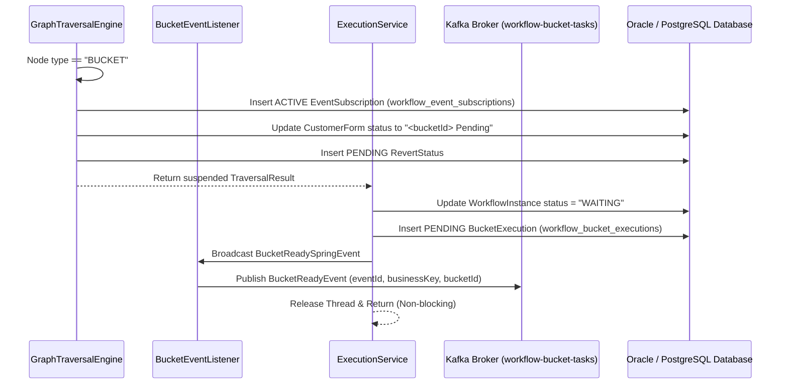
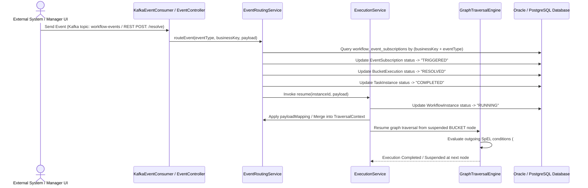

# Buckets & Outcomes Backend Architecture

This document describes how human-in-the-loop task queues (referred to as **Buckets** or **Outcomes**) are designed, scheduled, and executed within the `vth-workflow-service` backend module.

---

## 1. Database Schema & Entity Modeling

The bucket workload queue relies on five core JPA entities mapping to `workflow_` prefixed tables:

* **`Bucket`** ([Bucket.java](file:///c:/Users/hemant/Desktop/Projects/state-machine-engine/vth-workflow-service/src/main/java/com/vi/atlas/workflow/entity/Bucket.java)):
  Defines static queue metadata.
  - Table: `workflow_buckets`
  - `bucketId`: Unique business key (e.g. `OBCC`, `PREMIUM_APPROVAL`, `FOIR`).
  - `priority`: Urgency tier (`CRITICAL`, `HIGH`, `MEDIUM`, `LOW`).
  - `slaHours`: Time threshold in hours before SLA breach is flagged.
  - `ownerGroup`: Responsible operations team.

* **`BucketExecution`** ([BucketExecution.java](file:///c:/Users/hemant/Desktop/Projects/state-machine-engine/vth-workflow-service/src/main/java/com/vi/atlas/workflow/entity/BucketExecution.java)):
  Represents an active or resolved workload item in the operations queue.
  - Table: `workflow_bucket_executions`
  - `instanceId`: Associates the item with parent [`WorkflowInstance`](file:///c:/Users/hemant/Desktop/Projects/state-machine-engine/vth-workflow-service/src/main/java/com/vi/atlas/workflow/entity/WorkflowInstance.java).
  - `status`: Current queue state (`PENDING`, `IN_REVIEW`, `RESOLVED`).
  - `assignedTo`: Locked manager/operator ID claiming the item.
  - `slaBreached`: Calculated dynamically on query if `(createdAt + slaHours < now)`.

* **`EventSubscription`** ([EventSubscription.java](file:///c:/Users/hemant/Desktop/Projects/state-machine-engine/vth-workflow-service/src/main/java/com/vi/atlas/workflow/entity/EventSubscription.java)):
  Registers the wait-state correlation record.
  - Table: `workflow_event_subscriptions`
  - `businessKey`: Primary domain key (e.g. `CAF_ID`).
  - `eventType`: Matched event key (e.g. `PREMIUM_APPROVAL_COMPLETED`).
  - `status`: `ACTIVE`, `TRIGGERED`, `CANCELLED`.

* **`RevertStatus`** ([RevertStatus.java](file:///c:/Users/hemant/Desktop/Projects/state-machine-engine/vth-workflow-service/src/main/java/com/vi/atlas/workflow/entity/RevertStatus.java)):
  Provides audit timeline and sequential tracking for multi-step manual bucket transitions.
  - Table: `workflow_revert_status`

* **`TaskInstance`** ([TaskInstance.java](file:///c:/Users/hemant/Desktop/Projects/state-machine-engine/vth-workflow-service/src/main/java/com/vi/atlas/workflow/entity/TaskInstance.java)):
  Tracks task execution step details.
  - Table: `workflow_task_instances`

---

## 2. Execution & Outbound Notification Flow

When graph traversal encounters a node of type `BUCKET`:

```mermaid
sequenceDiagram
    participant Traversal as GraphTraversalEngine
    participant Listener as BucketEventListener
    participant ExecService as ExecutionService
    participant Kafka as Kafka Broker (workflow-bucket-tasks)
    participant DB as Oracle / PostgreSQL Database
    
    Traversal->>Traversal: Node type == "BUCKET"
    Traversal->>DB: Insert ACTIVE EventSubscription (workflow_event_subscriptions)
    Traversal->>DB: Update CustomerForm status to "<bucketId> Pending"
    Traversal->>DB: Insert PENDING RevertStatus
    
    Traversal-->>ExecService: Return suspended TraversalResult
    
    ExecService->>DB: Update WorkflowInstance status = "WAITING"
    ExecService->>DB: Insert PENDING BucketExecution (workflow_bucket_executions)
    ExecService->>Listener: Broadcast BucketReadySpringEvent
    
    Listener->>Kafka: Publish BucketReadyEvent (eventId, businessKey, bucketId)
    ExecService-->>ExecService: Release Thread & Return (Non-blocking)
```

### Detailed Sequence:
1. **Encountering Node**: [`GraphTraversalEngine.java`](file:///c:/Users/hemant/Desktop/Projects/state-machine-engine/vth-workflow-service/src/main/java/com/vi/atlas/workflow/service/traversal/GraphTraversalEngine.java) detects `node.getType() == "BUCKET"`.
2. **Subscription & Form Update**:
   - Inserts record into `workflow_event_subscriptions` with `businessKey = context.businessKey` and `status = 'ACTIVE'`.
   - Sets `workflow_customer_forms` status to `"<bucketId> Pending"`.
3. **Outbound Kafka Dispatch**:
   - [`BucketEventListener.java`](file:///c:/Users/hemant/Desktop/Projects/state-machine-engine/vth-workflow-service/src/main/java/com/vi/atlas/workflow/event/publisher/BucketEventListener.java) publishes [`BucketReadyEvent`](file:///c:/Users/hemant/Desktop/Projects/state-machine-engine/vth-workflow-common/src/main/java/com/vi/atlas/common/dto/BucketReadyEvent.java) to topic `workflow-bucket-tasks`.
   - Payload includes unique `eventId` (UUID for consumer deduplication), `instanceId`, `businessKey`, `bucketId`, `priority`, and `slaHours`.
4. **Non-Blocking Suspension**:
   - Updates `workflow_instances.status` to `WAITING`.
   - Inserts `workflow_bucket_executions` workload item in state `PENDING`.
   - Thread releases CPU and DB connections immediately.

---

## 3. Resolving and Resuming Workflows

Resolution can occur via **Kafka Event** (Production Domains) or **REST API** (Ops/Admin Tools):

```mermaid
sequenceDiagram
    actor Subsystem as External System / Manager UI
    participant Handler as KafkaEventConsumer / EventController
    participant Routing as EventRoutingService
    participant ExecService as ExecutionService
    participant Traversal as GraphTraversalEngine
    participant DB as Oracle / PostgreSQL Database

    Subsystem->>Handler: Send Event (Kafka topic: workflow-events / REST POST: /resolve)
    Handler->>Routing: routeEvent(eventType, businessKey, payload)
    
    Routing->>DB: Query workflow_event_subscriptions by (businessKey + eventType)
    Routing->>DB: Update EventSubscription status -> "TRIGGERED"
    Routing->>DB: Update BucketExecution status -> "RESOLVED"
    Routing->>DB: Update TaskInstance status -> "COMPLETED"
    
    Routing->>ExecService: Invoke resume(instanceId, payload)
    ExecService->>DB: Update WorkflowInstance status -> "RUNNING"
    ExecService->>Routing: Apply payloadMapping / Merge into TraversalContext
    
    ExecService->>Traversal: Resume graph traversal from suspended BUCKET node
    Traversal->>Traversal: Evaluate outgoing SpEL conditions (#context['status'] == 'APPROVED')
    Traversal-->>ExecService: Execution Completed / Suspended at next node
```

### Detailed Sequence:
1. **Approval Submission**:
   - **Production System**: Publishes completion message to Kafka topic `workflow-events`.
   - **Ops / Support Web App**: Calls REST endpoint `POST /api/v1/buckets/executions/{id}/resolve`.
2. **Correlation & State Transition**:
   - [`EventRoutingService.java`](file:///c:/Users/hemant/Desktop/Projects/state-machine-engine/vth-workflow-service/src/main/java/com/vi/atlas/workflow/service/EventRoutingService.java) queries `workflow_event_subscriptions` by `business_key` + `event_type`.
   - Updates entity statuses:
     - `workflow_event_subscriptions` $\rightarrow$ `TRIGGERED`
     - `workflow_bucket_executions` $\rightarrow$ `RESOLVED`
     - `workflow_task_instances` $\rightarrow$ `COMPLETED`
3. **Resumption & Downstream Access**:
   - [`ExecutionService.java`](file:///c:/Users/hemant/Desktop/Projects/state-machine-engine/vth-workflow-service/src/main/java/com/vi/atlas/workflow/service/ExecutionService.java) sets `WorkflowInstance` to `RUNNING`.
   - Merges inbound event payload into `TraversalContext`.
   - Resumes [`GraphTraversalEngine`](file:///c:/Users/hemant/Desktop/Projects/state-machine-engine/vth-workflow-service/src/main/java/com/vi/atlas/workflow/service/traversal/GraphTraversalEngine.java) traversal from the `BUCKET` node, evaluating downstream SpEL edge rules.
