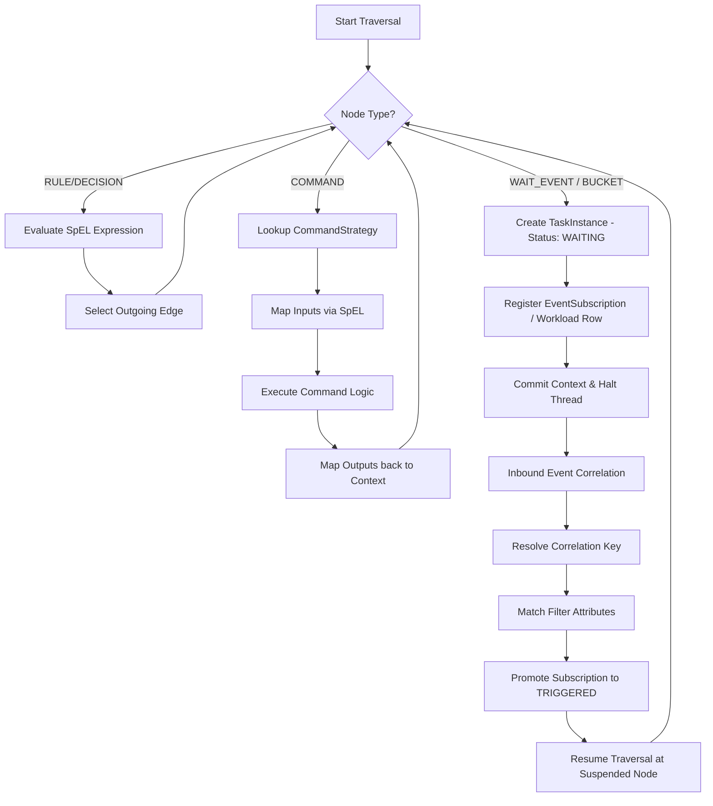

# Project Atlas: Command and Wait Architecture Pattern

This document provides a detailed technical overview of how the **Command Execution** and **Wait/Resumption** patterns are designed and implemented in the Project Atlas Spring Boot workflow engine.

---

## 1. Architectural Blueprint

The workflow engine transitions between **synchronous actions** (Commands) and **asynchronous halts** (Wait States). A single database transaction executes nodes sequentially until it encounters a state that requires external input, at which point it commits the state and halts the running thread.



---

## 2. The Command Execution System

The **Command System** decouples custom automated logic (such as REST API calls, database triggers, message publishing, or child workflow execution) from the main graph traversal loop using a registry-backed strategy pattern.

### Key Components

1.  **`WorkflowCommand`** (`WorkflowCommand.java`):
    An interface defining the implementation contract for custom activities:
    ```java
    public interface WorkflowCommand {
        String getCommandType();
        Map<String, Object> execute(Map<String, Object> input) throws Exception;
    }
    ```
2.  **`CommandRegistry`** (`CommandRegistry.java`):
    Maintains a dictionary of all custom commands registered as Spring Beans.
3.  **`Command Strategies`**:
    *   **`HttpRestCommand`**: Handles external REST integrations.
    *   **`MqPublishCommand`**: Publishes messages to Kafka topics.
    *   **`StartChildWorkflowCommand`**: Asynchronously boots sub-workflows.
    *   **`UpdateFormStatusCommand`**: Modifies user form statuses.
    *   **`CreateBucketCommand`**: Registers manual review buckets.

### Detailed Execution Phase

When the [GraphTraversalEngine.java](file:///Users/ratneshbharti/hemant/atlast_code/atlas-workflow-service/src/main/java/com/enterprise/atlas/workflow/service/GraphTraversalEngine.java) processes a `COMMAND` type node:

1.  **Resolve Command Type**: It extracts the `commandType` from the node definition (e.g., `MQ` or `REST`) and retrieves the bean from the registry.
2.  **Build Isolated Parameters**:
    *   It creates a fresh local parameter map.
    *   Injects execution metadata (`_instanceId`, `_contextId`, `_workflowKey`, `_nodeId`).
3.  **SpEL Input Mapping**:
    *   Evaluates expression maps defined in the workflow JSON `inputMapping` structure against the parent workflow context map.
    *   Example: `{ "context.transactionAmount": "paymentAmount" }` resolves the global variable and puts it in the command payload as `paymentAmount`.
4.  **Execution**: 
    The strategy executes (`command.execute(input)`). For instance, [MqPublishCommand.java](file:///Users/ratneshbharti/hemant/atlast_code/atlas-workflow-service/src/main/java/com/enterprise/atlas/workflow/service/MqPublishCommand.java) will publish the payload to the specified topic using `KafkaTemplate`.
5.  **SpEL Output Mapping**:
    *   Maps result payloads back into the global workflow context based on the node's `outputMapping` schema.
    *   Example: `{ "status": "context.paymentStatus" }` writes the return code to the global context.
6.  **Task Finalization**: Updates the task instance state to `COMPLETED`.

---

## 3. The Wait & Resumption System

When execution requires a human action or an external signal, the engine halts the thread and sets up a correlation listener.

### Wait Nodes & Suspension

1.  **`WAIT_EVENT` (Event-driven Listeners)**:
    *   Halts traversal and creates a `TaskInstance` in `WAITING` status.
    *   Creates an active `EventSubscription` row in the database indicating the expected `eventType` (e.g., `PAYMENT_RECEIVED`).
2.  **`BUCKET` (Human-in-the-loop Task Queue)**:
    *   Registers a `RevertStatus` registry entry and a `BucketExecution` row.
    *   Transitions parent `WorkflowInstance` and `ExecutionLog` states to `WAITING`.
    *   Fires a Spring event which [BucketEventListener.java](file:///Users/ratneshbharti/hemant/atlast_code/atlas-workflow-service/src/main/java/com/enterprise/atlas/workflow/event/BucketEventListener.java) publishes to the Kafka `workflow-bucket-tasks` topic as a `BUCKET_READY` payload.
3.  **`SUB_WORKFLOW` (Call Activities)**:
    *   Starts a child workflow and registers an `EventSubscription` for a `CHILD_WORKFLOW_COMPLETED` event linked to the child instance ID.

### Resumption and Event Correlation

Resumption matches incoming events to active waiting transactions via the **[EventRoutingService.java](file:///Users/ratneshbharti/hemant/atlast_code/atlas-workflow-service/src/main/java/com/enterprise/atlas/workflow/service/EventRoutingService.java)**.

```
Inbound Event (Kafka / REST)
       │
       ▼
[EventRoutingService]
       │
       ├─► 1. Resolve Correlation Key: Business Key + Event Type + Path Filters
       ├─► 2. Match Active EventSubscription Records
       │
       ▼ (If match found)
[Promote State]
       │
       ├─► Mark Subscription as TRIGGERED
       ├─► Transition TaskInstance to COMPLETED
       │
       ▼
[ExecutionService.resume()]
       │
       ├─► Set WorkflowInstance to RUNNING
       ├─► Merge Event Payload into Global Context
       ├─► GraphTraversalEngine.traverse(resuming from currentNodeId)
```

1.  **Correlation Resolving**:
    Inbound events correlate using a composite lookup expression:
    $$\text{Correlation Key} = \text{Business Key} + \text{Event Type} + \text{Filter Attributes}$$
    This matches the event payload against active database subscriptions.
2.  **State Promotion**:
    The matching subscription is updated to `TRIGGERED`, and the related `TaskInstance` status is promoted to `COMPLETED` while storing the incoming payload in its output data.
3.  **Context Merging**:
    `ExecutionService.resume(instanceId, additionalContext)` fetches the serialized context, merges the new variables from the incoming event, and marks the parent instance as `RUNNING`.
4.  **Traversal Resumption**:
    The traversal restarts **starting exactly from the node where it suspended**. It evaluates the outgoing conditional edges of the suspended node using the updated context variables to determine the next path.

---

## 4. Advanced Execution Features

### Activation-Based Traversal Loop
Instead of simple pointer-based sequential traversal, nodes can define an optional `activationCondition` (a SpEL expression evaluated against the context map).
*   The engine repeatedly scans inactive nodes in the definition graph.
*   If a node has an `activationCondition`, it evaluates it. If it resolves to `true`, the node is activated.
*   If it encounters a `BUCKET` during activation, the loop suspends and waits.
*   Upon resumption, the engine triggers the next wave of reactive activations starting at the suspended node.

### Deterministic Replay / Mock Execution
To enable developer troubleshooting:
*   The engine can walk the graph from the START node using historical logs.
*   When it hits a `COMMAND`, `BUCKET`, or `WAIT_EVENT` node, it intercepts the call and reads the outcome recorded in the step audit log rather than calling the live API or waiting for user inputs.
*   SpEL rules and conditional routes are evaluated *live*, letting developers tweak rule configurations and preview routing changes.

---

## 5. Handling Multiple Outcomes (Bucket Resolution)

When a bucket task is resolved (e.g. Approved, Rejected, Parked), the workflow engine is resumed with contextual information about the resolution. Developers can implement divergent actions depending on these outcomes in two primary ways.

### Injected Context Variables

Upon resumption, **[BucketResolutionService.java](file:///Users/ratneshbharti/hemant/atlast_code/atlas-workflow-service/src/main/java/com/enterprise/atlas/workflow/service/BucketResolutionService.java)** updates the workflow instance's context map with the following variables:

| Context Variable Key | Value Type | Description / Example |
| :--- | :--- | :--- |
| `context.lastOutcome` | `String` | The raw resolution choice: `Accept`, `Reject`, `Park` |
| `context.lastBucketId` | `String` | Technical ID of the resolved bucket: `A2` |
| `context.form_status` | `String` | Combined bucket key and outcome: `A2Accept`, `A2Reject` |
| `context.notes` | `String` | Operator comments / audit details entered during approval |

---

### Option A: Conditional Routing via Downstream Decision Nodes

In standard sequential workflows, you can route the output to different nodes by placing a **Decision Node** immediately following the `BUCKET` node, with conditional edges evaluated via SpEL expressions against `context.lastOutcome` or `context.form_status`.

#### Example Graph Definition (Edges)
```json
{
  "edges": [
    {
      "id": "edge_approve",
      "source": "DECISION_NODE_ID",
      "target": "SUCCESS_NODE_ID",
      "data": {
        "condition": "context.lastOutcome == 'Accept'"
      }
    },
    {
      "id": "edge_reject",
      "source": "DECISION_NODE_ID",
      "target": "REJECT_NODE_ID",
      "data": {
        "condition": "context.lastOutcome == 'Reject'"
      }
    },
    {
      "id": "edge_park",
      "source": "DECISION_NODE_ID",
      "target": "PARKING_LOOP_NODE_ID",
      "data": {
        "condition": "context.lastOutcome == 'Park'"
      }
    }
  ]
}
```

---

### Option B: Activation Conditions in Reactive Traversal

If you are using the activation-based runtime, downstream nodes can be configured to execute independently as soon as their activation condition matches the resolution context:

```json
{
  "nodeId": "PROCESS_PAYMENT_NODE",
  "type": "COMMAND",
  "data": {
    "activationCondition": "context.lastOutcome == 'Accept' && context.lastBucketId == 'A2'"
  }
}
```

