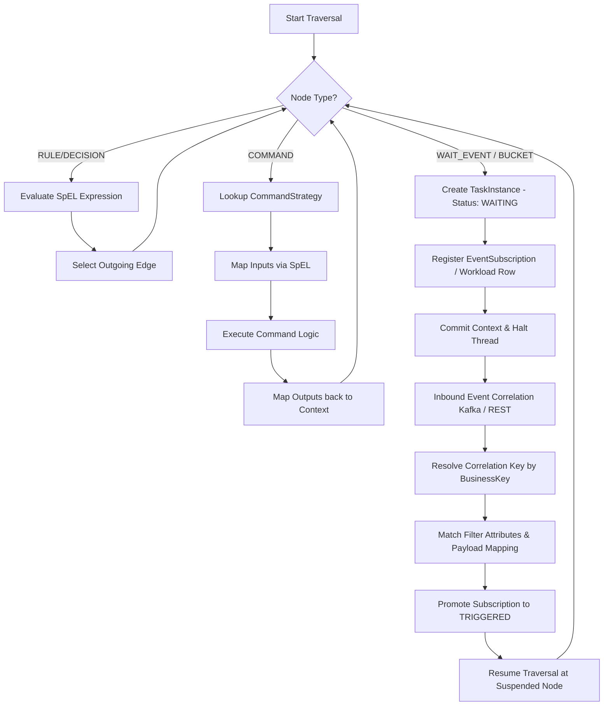

# Command and Wait Architecture Pattern

This document provides a detailed technical overview of how **Command Execution** and **Wait/Resumption** patterns are designed and implemented in the `vth-workflow-service` backend module.

---

## 1. Architectural Blueprint

The workflow engine transitions between **synchronous actions** (Commands) and **asynchronous halts** (Wait States). A single thread executes nodes sequentially until it encounters a node that requires external input or manual approval. At that point, it commits state to `workflow_instances` and `workflow_event_subscriptions` and halts the thread without holding CPU or database connections.


```mermaid
graph TD
    A[Start Traversal] --> B{Node Type?}
    B -- RULE/DECISION --> C[Evaluate SpEL Expression]
    C --> D[Select Outgoing Edge]
    D --> B
    
    B -- COMMAND --> E[Lookup CommandStrategy]
    E --> F[Map Inputs via SpEL]
    F --> G[Execute Command Logic]
    G --> H[Map Outputs back to Context]
    H --> B
    
    B -- WAIT_EVENT / BUCKET --> I[Create TaskInstance - Status: WAITING]
    I --> J[Register EventSubscription / Workload Row]
    J --> K[Commit Context & Halt Thread]
    
    K --> L[Inbound Event Correlation Kafka / REST]
    L --> M[Resolve Correlation Key by BusinessKey]
    M --> N[Match Filter Attributes & Payload Mapping]
    N --> O[Promote Subscription to TRIGGERED]
    O --> P[Resume Traversal at Suspended Node]
    P --> B
```

---

## 2. The Command Execution System

The **Command System** decouples custom automated logic (such as REST API calls, database triggers, message publishing, or child workflow execution) from the main graph traversal loop using a registry-backed strategy pattern.

### Key Components

1. **`WorkflowCommand`** ([`WorkflowCommand.java`](file:///c:/Users/hemant/Desktop/Projects/state-machine-engine/vth-workflow-service/src/main/java/com/vi/atlas/workflow/service/command/WorkflowCommand.java)):
   An interface defining the implementation contract for custom activities:
   ```java
   public interface WorkflowCommand {
       String getCommandType();
       Map<String, Object> execute(Map<String, Object> input) throws Exception;
   }
   ```
2. **`CommandRegistry`** ([`CommandRegistry.java`](file:///c:/Users/hemant/Desktop/Projects/state-machine-engine/vth-workflow-service/src/main/java/com/vi/atlas/workflow/service/command/CommandRegistry.java)):
   Maintains a dictionary of all custom commands registered as Spring Beans.
3. **Command Strategies**:
   - **`HttpRestCommand`**: Handles external REST integrations.
   - **`MqPublishCommand`**: Publishes messages to Kafka topics.
   - **`StartChildWorkflowCommand`**: Asynchronously boots sub-workflows.
   - **`UpdateFormStatusCommand`**: Modifies customer form statuses.
   - **`CreateBucketCommand`**: Registers manual review buckets.

### Detailed Execution Phase

When [`GraphTraversalEngine.java`](file:///c:/Users/hemant/Desktop/Projects/state-machine-engine/vth-workflow-service/src/main/java/com/vi/atlas/workflow/service/traversal/GraphTraversalEngine.java) processes a `COMMAND` type node:

1. **Resolve Command Type**: Extracts `commandType` from node data (e.g. `MQ` or `REST`) and retrieves the bean from `CommandRegistry`.
2. **Build Isolated Parameters**:
   - Creates a fresh local parameter map.
   - Injects execution metadata (`_instanceId`, `_contextId`, `_workflowKey`, `_nodeId`).
3. **SpEL Input Mapping**:
   - Evaluates expression maps defined in the workflow JSON `inputMapping` structure against the parent workflow context map.
   - Example: `{ "context.transactionAmount": "paymentAmount" }` resolves the global variable and puts it in the command payload as `paymentAmount`.
4. **Execution**:
   - Executes strategy ([`MqPublishCommand.java`](file:///c:/Users/hemant/Desktop/Projects/state-machine-engine/vth-workflow-service/src/main/java/com/vi/atlas/workflow/service/command/impl/MqPublishCommand.java)). Publishes payload to Kafka topic using `KafkaTemplate`.
5. **SpEL Output Mapping**:
   - Maps result payloads back into the global workflow context based on `outputMapping`.
6. **Task Finalization**: Updates [`TaskInstance`](file:///c:/Users/hemant/Desktop/Projects/state-machine-engine/vth-workflow-service/src/main/java/com/vi/atlas/workflow/entity/TaskInstance.java) state to `COMPLETED`.

---

## 3. The Wait & Resumption System

When execution requires a human action or external signal, the engine halts the thread and sets up a correlation listener.

### Wait Nodes & Suspension

1. **`WAIT_EVENT` (Event-driven Listeners)**:
   - Halts traversal and creates a `TaskInstance` in `WAITING` status.
   - Creates an active [`EventSubscription`](file:///c:/Users/hemant/Desktop/Projects/state-machine-engine/vth-workflow-service/src/main/java/com/vi/atlas/workflow/entity/EventSubscription.java) in table `workflow_event_subscriptions` (`businessKey` = `CAF_ID`, `eventType` = `KAFKA_PAYMENT`).
2. **`BUCKET` (Human-in-the-loop Task Queue)**:
   - Registers a `RevertStatus` entry and a `BucketExecution` row in `workflow_bucket_executions`.
   - Transitions `workflow_instances` state to `WAITING`.
   - Fires a Spring event which [`BucketEventListener.java`](file:///c:/Users/hemant/Desktop/Projects/state-machine-engine/vth-workflow-service/src/main/java/com/vi/atlas/workflow/event/publisher/BucketEventListener.java) publishes to Kafka `workflow-bucket-tasks` topic as a `BucketReadyEvent` payload.
3. **`SUB_WORKFLOW` (Call Activities)**:
   - Boots child workflow and registers subscription for `CHILD_WORKFLOW_COMPLETED`.

### Resumption and Event Correlation

Resumption matches incoming events to active waiting transactions via [`EventRoutingService.java`](file:///c:/Users/hemant/Desktop/Projects/state-machine-engine/vth-workflow-service/src/main/java/com/vi/atlas/workflow/service/EventRoutingService.java) and [`KafkaEventConsumer.java`](file:///c:/Users/hemant/Desktop/Projects/state-machine-engine/vth-workflow-service/src/main/java/com/vi/atlas/workflow/config/KafkaEventConsumer.java).

```text
Inbound Event (Kafka / REST)
       │
       ▼
[EventRoutingService]
       │
       ├─► 1. Resolve Correlation Key: Business Key (CAF_ID) + Event Type + Path Filters
       ├─► 2. Match Active EventSubscription Records in workflow_event_subscriptions
       │
       ▼ (If match found)
[Promote State]
       │
       ├─► Mark Subscription as TRIGGERED
       ├─► Transition TaskInstance to COMPLETED
       │
       ▼
[ExecutionService.resume()]
       │
       ├─► Set WorkflowInstance to RUNNING
       ├─► Apply payloadMapping & Merge Event Payload into Global Context
       ├─► GraphTraversalEngine.traverse(resuming from currentNodeId)
```

1. **Correlation Resolution**:
   Inbound events correlate using domain business keys:
   $$\text{Correlation Key} = \text{Business Key} + \text{Event Type} + \text{Filter Attributes}$$
   This matches incoming payloads against database subscription rows without requiring external systems to store engine UUIDs.
2. **State Promotion**:
   Matching subscription is updated to `TRIGGERED`, related `TaskInstance` status is promoted to `COMPLETED`, and callback output is stored.
3. **Context Merging**:
   `ExecutionService.resume(instanceId, additionalContext)` fetches serialized context, merges new variables from the incoming event, and marks parent instance as `RUNNING`.
4. **Traversal Resumption**:
   Traversal restarts **starting exactly from the node where it suspended**, evaluating outgoing SpEL edge conditions using updated context variables.

---

## 4. Multiple Outcomes (Bucket Resolution)

When a bucket task is resolved (e.g. Approved, Rejected, Parked), [`BucketResolutionService.java`](file:///c:/Users/hemant/Desktop/Projects/state-machine-engine/vth-workflow-service/src/main/java/com/vi/atlas/workflow/service/BucketResolutionService.java) updates context with resolution attributes:

| Context Variable Key | Value Type | Description / Example |
| :--- | :--- | :--- |
| `context.lastOutcome` | `String` | Raw resolution choice: `APPROVED`, `REJECTED`, `PARKED` |
| `context.lastBucketId` | `String` | Technical ID of resolved bucket: `PREMIUM_APPROVAL` |
| `context.form_status` | `String` | Combined status: `PREMIUM_APPROVAL_APPROVED` |
| `context.notes` | `String` | Comments entered during approval |

Downstream decision nodes evaluate conditional edges via SpEL expressions against `#context['lastOutcome']` or mapped context variables (`#context['appStatus'] == 'APPROVED'`).
