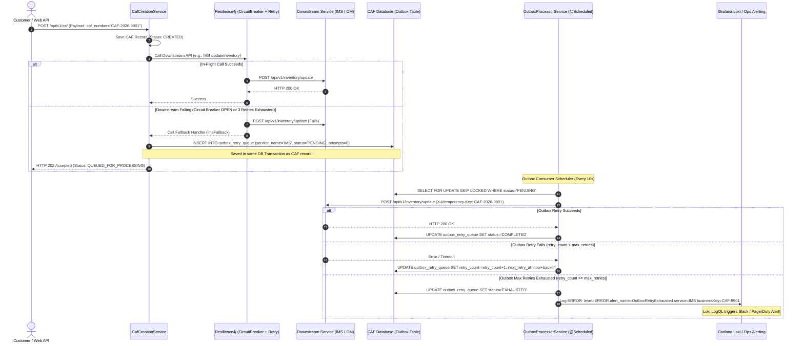

# Low-Level Design (LLD): CAF Service Resilience & Transactional Outbox Framework

This document details the Low-Level Design (LLD) for the **Resilience & Transactional Outbox Framework** within the CAF Creation Service. It explains the required functionality step-by-step in clear English, supported by focused code snippets for each step, and linked together into complete implementation classes.

---

## 1. System Overview & Component Architecture

### 1.1 Two-Tier Resilience Strategy Explained

When a customer submits a Customer Acquisition Form (CAF), the CAF Creation Service must communicate with several downstream microservices:
1. **IMS (Inventory Management System)**: Updates SIM/device inventory via `updateInventory`.
2. **OM (Order Management System)**: Creates downstream provisioning orders via `orderCreation`.
3. **Workflow Engine**: Triggers state machine journey orchestrations.

If a downstream API experiences temporary latency or downtime, failing the entire CAF creation request immediately degrades customer experience. To solve this, the service implements a **Two-Tier Resilience Strategy**:

- **Tier 1 (In-Flight Resilience via Resilience4j)**:
  - Immediately retries transient network errors (up to 3 attempts with exponential backoff).
  - Uses a count-based Circuit Breaker (monitoring a sliding window of 50 calls). If 60% of calls fail (30 out of 50), the Circuit Breaker trips to `OPEN`, failing fast to prevent cascading thread starvation.
- **Tier 2 (Asynchronous Transactional Outbox & Eventual Consistency)**:
  - If Resilience4j retries are exhausted OR if the Circuit Breaker is `OPEN`, the execution routes to a Fallback handler.
  - The Fallback handler persists the failed request payload into an **Outbox Table** (`outbox_retry_queue`) within the **same database transaction** as the CAF record creation.
  - A background **Outbox Processor Service** periodically polls pending entries using database row locking (`FOR UPDATE SKIP LOCKED`), retries downstream calls with exponential backoff + random jitter, and logs structured Grafana Loki alerts if all retries fail.



---

## 2. Outbox Table Data Modeling & Persistence Mechanics

### 2.1 Functional Design of Outbox Persistence

The Outbox pattern guarantees **Eventual Consistency** by making database persistence atomic with business entity creation:
1. When a CAF is created, its entity is saved to `caf_records`.
2. If calling IMS or OM fails, a new record is written to `outbox_retry_queue`.
3. Because both writes execute in the same Spring `@Transactional` block, either **both** succeed or **both** roll back. It is impossible to have a CAF record created without its corresponding outbox retry entry if downstream calls fail.

#### Outbox Status Lifecycle:
- **`PENDING`**: Newly inserted retry task waiting for background worker processing.
- **`IN_PROGRESS`**: Claimed by a worker thread for active HTTP dispatch.
- **`COMPLETED`**: Downstream service responded with HTTP `200 OK`.
- **`EXHAUSTED`**: All permitted outbox retries (e.g. 5 attempts) failed. Operations team alerted via Loki.

---

### 2.2 Oracle / PostgreSQL DDL Script

```sql
CREATE TABLE outbox_retry_queue (
    outbox_id VARCHAR2(36) NOT NULL,
    service_name VARCHAR2(50) NOT NULL,    -- 'imsService', 'omService'
    business_key VARCHAR2(100) NOT NULL,   -- e.g., 'CAF-2026-9901'
    endpoint_url VARCHAR2(500) NOT NULL,
    http_method VARCHAR2(10) NOT NULL,     -- 'POST', 'PUT'
    headers_json VARCHAR2(2000),           -- Serialized HTTP headers
    payload_json CLOB NOT NULL,            -- Request body JSON
    status VARCHAR2(20) DEFAULT 'PENDING' NOT NULL, -- 'PENDING', 'IN_PROGRESS', 'COMPLETED', 'EXHAUSTED'
    retry_count NUMBER(5) DEFAULT 0 NOT NULL,
    max_retries NUMBER(5) DEFAULT 5 NOT NULL,
    next_retry_at TIMESTAMP NOT NULL,
    last_error VARCHAR2(1000),
    created_at TIMESTAMP DEFAULT CURRENT_TIMESTAMP NOT NULL,
    updated_at TIMESTAMP DEFAULT CURRENT_TIMESTAMP NOT NULL,
    CONSTRAINT pk_outbox_retry PRIMARY KEY (outbox_id)
);

CREATE INDEX idx_outbox_poll ON outbox_retry_queue(service_name, status, next_retry_at);
CREATE INDEX idx_outbox_bizkey ON outbox_retry_queue(business_key);
```

---

### 2.3 JPA Entity Implementation (`OutboxEntry.java`)

```java
package com.vi.caf.entity;

import jakarta.persistence.*;
import java.time.LocalDateTime;
import java.util.UUID;

@Entity
@Table(name = "outbox_retry_queue", indexes = {
    @Index(name = "idx_outbox_poll", columnList = "service_name, status, next_retry_at"),
    @Index(name = "idx_outbox_bizkey", columnList = "business_key")
})
public class OutboxEntry {

    public enum OutboxStatus { PENDING, IN_PROGRESS, COMPLETED, EXHAUSTED }

    @Id
    @Column(name = "outbox_id", length = 36)
    private String id;

    @Column(name = "service_name", nullable = false, length = 50)
    private String serviceName;

    @Column(name = "business_key", nullable = false, length = 100)
    private String businessKey;

    @Column(name = "endpoint_url", nullable = false, length = 500)
    private String endpointUrl;

    @Column(name = "http_method", nullable = false, length = 10)
    private String httpMethod;

    @Column(name = "headers_json", length = 2000)
    private String headersJson;

    @Lob
    @Column(name = "payload_json", nullable = false)
    private String payloadJson;

    @Enumerated(EnumType.STRING)
    @Column(name = "status", nullable = false, length = 20)
    private OutboxStatus status = OutboxStatus.PENDING;

    @Column(name = "retry_count", nullable = false)
    private Integer retryCount = 0;

    @Column(name = "max_retries", nullable = false)
    private Integer maxRetries = 5;

    @Column(name = "next_retry_at", nullable = false)
    private LocalDateTime nextRetryAt;

    @Column(name = "last_error", length = 1000)
    private String lastError;

    @Column(name = "created_at", nullable = false, updatable = false)
    private LocalDateTime createdAt;

    @Column(name = "updated_at", nullable = false)
    private LocalDateTime updatedAt;

    public OutboxEntry() {}

    @PrePersist
    protected void onCreate() {
        if (this.id == null) this.id = UUID.randomUUID().toString();
        this.createdAt = LocalDateTime.now();
        this.updatedAt = LocalDateTime.now();
        if (this.nextRetryAt == null) this.nextRetryAt = LocalDateTime.now();
    }

    @PreUpdate
    protected void onUpdate() {
        this.updatedAt = LocalDateTime.now();
    }

    // Getters & Setters
    public String getId() { return id; }
    public void setId(String id) { this.id = id; }
    public String getServiceName() { return serviceName; }
    public void setServiceName(String serviceName) { this.serviceName = serviceName; }
    public String getBusinessKey() { return businessKey; }
    public void setBusinessKey(String businessKey) { this.businessKey = businessKey; }
    public String getEndpointUrl() { return endpointUrl; }
    public void setEndpointUrl(String endpointUrl) { this.endpointUrl = endpointUrl; }
    public String getHttpMethod() { return httpMethod; }
    public void setHttpMethod(String httpMethod) { this.httpMethod = httpMethod; }
    public String getHeadersJson() { return headersJson; }
    public void setHeadersJson(String headersJson) { this.headersJson = headersJson; }
    public String getPayloadJson() { return payloadJson; }
    public void setPayloadJson(String payloadJson) { this.payloadJson = payloadJson; }
    public OutboxStatus getStatus() { return status; }
    public void setStatus(OutboxStatus status) { this.status = status; }
    public Integer getRetryCount() { return retryCount; }
    public void setRetryCount(Integer retryCount) { this.retryCount = retryCount; }
    public Integer getMaxRetries() { return maxRetries; }
    public void setMaxRetries(Integer maxRetries) { this.maxRetries = maxRetries; }
    public LocalDateTime getNextRetryAt() { return nextRetryAt; }
    public void setNextRetryAt(LocalDateTime nextRetryAt) { this.nextRetryAt = nextRetryAt; }
    public String getLastError() { return lastError; }
    public void setLastError(String lastError) { this.lastError = lastError; }
    public LocalDateTime getCreatedAt() { return createdAt; }
    public LocalDateTime getUpdatedAt() { return updatedAt; }
}
```

---

## 3. Resilience4j Circuit Breaker & Fallback Integration

### 3.1 Functionality Breakdown (Prose Explanation)

The Resilience4j layer intercepts outgoing HTTP client requests before they leave the service:

1. **In-Flight Retry Evaluation**:
   - When a service method annotated with `@Retry(name = "imsService")` runs, Resilience4j executes the call up to 3 times with exponential backoff (`200ms`, `400ms`).
2. **Circuit Breaker Evaluation**:
   - The `@CircuitBreaker(name = "imsService")` aspect tracks HTTP failures over a count-based sliding window of 50 calls.
   - If 30 out of 50 calls fail ($60\%$ threshold), the Circuit Breaker transitions to `OPEN`.
   - Subsequent calls while `OPEN` immediately short-circuit without hitting the network (`CallNotPermittedException`).
3. **Fallback Invocation & Outbox Persistence**:
   - When retries fail or the Circuit Breaker is `OPEN`, Resilience4j redirects control to `imsInventoryFallback()`.
   - The fallback method serializes the request DTO into JSON, populates `OutboxEntry`, and saves it to the database.

---

### 3.2 Resilience4j YAML Configuration (`application.yml`)

```yaml
# Resilience4j Native CircuitBreaker & Retry Configuration
resilience4j:
  circuitbreaker:
    instances:
      imsService:
        sliding-window-type: COUNT_BASED
        sliding-window-size: 50
        minimum-number-of-calls: 20
        failure-rate-threshold: 60 # Trips when 30/50 fail (60%)
        wait-duration-in-open-state: 30s
        permitted-number-of-calls-in-half-open-state: 10
        automatic-transition-from-open-to-half-open-enabled: true
      omService:
        sliding-window-type: COUNT_BASED
        sliding-window-size: 50
        failure-rate-threshold: 50
        wait-duration-in-open-state: 30s
  retry:
    instances:
      imsService:
        max-attempts: 3
        wait-duration: 200ms
        enable-exponential-backoff: true
        exponential-backoff-multiplier: 2

# Custom Per-Service Outbox Settings
caf:
  resilience:
    outbox:
      polling-interval-ms: 10000
      batch-size: 20
    integrations:
      imsService:
        enabled: true
        max-outbox-retries: 5
        base-backoff-seconds: 30
      omService:
        enabled: true
        max-outbox-retries: 3
        base-backoff-seconds: 60
```

---

### 3.3 Integration Client Service (`DownstreamIntegrationService.java`)

#### Step-by-Step Code Structure:

- **Step 1: Execute Call with Resilience4j Annotations**:
```java
@CircuitBreaker(name = "imsService", fallbackMethod = "imsInventoryFallback")
@Retry(name = "imsService")
public ImsInventoryResponse updateImsInventory(ImsInventoryRequest request) {
    String url = "https://ims-service.internal/api/v1/inventory/update";
    return restTemplate.postForObject(url, request, ImsInventoryResponse.class);
}
```

- **Step 2: Fallback Method Catching Exceptions & Routing to Outbox**:
```java
public ImsInventoryResponse imsInventoryFallback(ImsInventoryRequest request, Throwable t) {
    log.warn("IMS service call failed / circuit breaker open for CAF {}. Error: {}", request.getCafNumber(), t.getMessage());

    CafResilienceConfig.ServiceIntegrationConfig config = resilienceConfig.getIntegrations().get("imsService");
    if (config != null && config.isEnabled()) {
        saveToOutbox("imsService", request.getCafNumber(), "https://ims-service.internal/api/v1/inventory/update", request, t.getMessage(), config);
    }
    return new ImsInventoryResponse(request.getCafNumber(), "QUEUED_FOR_ASYNC_RETRY", "Saved to Outbox Queue");
}
```

#### Stitched Complete Class Implementation:

```java
package com.vi.caf.service;

import com.fasterxml.jackson.databind.ObjectMapper;
import com.vi.caf.config.CafResilienceConfig;
import com.vi.caf.dto.ImsInventoryRequest;
import com.vi.caf.dto.ImsInventoryResponse;
import com.vi.caf.entity.OutboxEntry;
import com.vi.caf.repository.OutboxRepository;
import io.github.resilience4j.circuitbreaker.annotation.CircuitBreaker;
import io.github.resilience4j.retry.annotation.Retry;
import org.slf4j.Logger;
import org.slf4j.LoggerFactory;
import org.springframework.beans.factory.annotation.Autowired;
import org.springframework.stereotype.Service;
import org.springframework.web.client.RestTemplate;

import java.time.LocalDateTime;

@Service
public class DownstreamIntegrationService {

    private static final Logger log = LoggerFactory.getLogger(DownstreamIntegrationService.class);

    @Autowired private RestTemplate restTemplate;
    @Autowired private OutboxRepository outboxRepository;
    @Autowired private CafResilienceConfig resilienceConfig;
    @Autowired private ObjectMapper objectMapper;

    @CircuitBreaker(name = "imsService", fallbackMethod = "imsInventoryFallback")
    @Retry(name = "imsService")
    public ImsInventoryResponse updateImsInventory(ImsInventoryRequest request) {
        String url = "https://ims-service.internal/api/v1/inventory/update";
        return restTemplate.postForObject(url, request, ImsInventoryResponse.class);
    }

    public ImsInventoryResponse imsInventoryFallback(ImsInventoryRequest request, Throwable t) {
        log.warn("IMS service call failed / circuit breaker open for CAF {}. Error: {}", 
                request.getCafNumber(), t.getMessage());

        CafResilienceConfig.ServiceIntegrationConfig config = 
                resilienceConfig.getIntegrations().get("imsService");

        if (config != null && config.isEnabled()) {
            saveToOutbox("imsService", request.getCafNumber(), 
                    "https://ims-service.internal/api/v1/inventory/update", 
                    request, t.getMessage(), config);
        }

        return new ImsInventoryResponse(request.getCafNumber(), "QUEUED_FOR_ASYNC_RETRY", "Saved to Outbox Queue");
    }

    private void saveToOutbox(String serviceName, String businessKey, String endpointUrl, 
                              Object payload, String errorMsg, CafResilienceConfig.ServiceIntegrationConfig config) {
        try {
            OutboxEntry entry = new OutboxEntry();
            entry.setServiceName(serviceName);
            entry.setBusinessKey(businessKey);
            entry.setEndpointUrl(endpointUrl);
            entry.setHttpMethod("POST");
            entry.setPayloadJson(objectMapper.writeValueAsString(payload));
            entry.setHeadersJson("{\"Content-Type\":\"application/json\"}");
            entry.setStatus(OutboxEntry.OutboxStatus.PENDING);
            entry.setRetryCount(0);
            entry.setMaxRetries(config.getMaxOutboxRetries());
            entry.setNextRetryAt(LocalDateTime.now().plusSeconds(config.getBaseBackoffSeconds()));
            entry.setLastError(errorMsg != null && errorMsg.length() > 1000 ? errorMsg.substring(0, 1000) : errorMsg);

            outboxRepository.save(entry);
            log.info("Persisted OutboxEntry ID {} for businessKey {} to database.", entry.getId(), businessKey);
        } catch (Exception ex) {
            log.error("CRITICAL: Failed to save OutboxEntry for businessKey {}: {}", businessKey, ex.getMessage(), ex);
        }
    }
}
```

---

## 4. Outbox Consumer Service & Worker Architecture

The Outbox Consumer framework consists of 3 distinct components:
1. **Concurrency Lock Repository (`OutboxRepository`)**: Uses SQL `SKIP LOCKED` to allow multiple service replicas to poll concurrently without lock collisions.
2. **Exponential Backoff Calculator (`BackoffCalculator`)**: Computes non-linear retry delays with random jitter.
3. **Scheduled Outbox Worker (`OutboxProcessorService`)**: Periodically queries pending items, executes HTTP retries, updates statuses, and triggers Loki alerts upon exhaustion.

---

### 4.1 Step 1: Database Row Concurrency (`OutboxRepository.java`)

- **Prose Explanation**: When scaling the CAF Creation Service to multiple Kubernetes pods or replica instances, a standard `SELECT * FROM outbox_retry_queue` would cause all pods to poll the exact same outbox rows simultaneously, leading to duplicate HTTP calls or pessimistic lock contention.
- Using `FOR UPDATE SKIP LOCKED` instructs the database engine to lock rows currently claimed by Pod 1 and cause Pod 2 to skip those locked rows, claiming the next available batch without waiting.

```java
package com.vi.caf.repository;

import com.vi.caf.entity.OutboxEntry;
import org.springframework.data.domain.Pageable;
import org.springframework.data.jpa.repository.JpaRepository;
import org.springframework.data.jpa.repository.Query;
import org.springframework.data.repository.query.Param;
import org.springframework.stereotype.Repository;

import java.time.LocalDateTime;
import java.util.List;

@Repository
public interface OutboxRepository extends JpaRepository<OutboxEntry, String> {

    @Query(value = """
        SELECT * FROM outbox_retry_queue 
        WHERE service_name = :serviceName 
          AND status = 'PENDING' 
          AND next_retry_at <= :now 
        ORDER BY created_at ASC 
        FOR UPDATE SKIP LOCKED
        """, nativeQuery = true)
    List<OutboxEntry> findPendingEntriesForUpdate(
            @Param("serviceName") String serviceName, 
            @Param("now") LocalDateTime now, 
            Pageable pageable
    );
}
```

---

### 4.2 Step 2: Exponential Backoff & Jitter Calculator (`BackoffCalculator.java`)

- **Prose Explanation**: When a downstream API goes down, retrying at fixed intervals (e.g. every 10 seconds) creates a "thundering herd" effect once the downstream API recovers.
- The backoff calculator uses exponential delays:
  $$\text{delay} = \text{baseBackoffSeconds} \times 2^{\text{retryCount}} + \text{randomJitter}$$
- For a base delay of 30 seconds:
  - Attempt 1: $30 \times 2^1 + \text{jitter} \approx 62\text{s}$
  - Attempt 2: $30 \times 2^2 + \text{jitter} \approx 124\text{s}$
  - Attempt 3: $30 \times 2^3 + \text{jitter} \approx 245\text{s}$

```java
package com.vi.caf.util;

import java.time.LocalDateTime;
import java.util.concurrent.ThreadLocalRandom;

public class BackoffCalculator {

    public static LocalDateTime calculateNextRetryTime(int currentRetryCount, int baseBackoffSeconds) {
        long exponentialMultiplier = (long) Math.pow(2, Math.min(currentRetryCount, 10));
        long delaySeconds = baseBackoffSeconds * exponentialMultiplier;
        
        // Add random jitter (1 to 5 seconds) to prevent thundering herd
        long jitterSeconds = ThreadLocalRandom.current().nextLong(1, 6);
        long totalDelaySeconds = delaySeconds + jitterSeconds;

        return LocalDateTime.now().plusSeconds(totalDelaySeconds);
    }
}
```

---

### 4.3 Step 3: Scheduled Outbox Worker (`OutboxProcessorService.java`)

#### Step-by-Step Execution Code Structure:

- **Step A: Scheduled Polling Trigger**:
```java
@Scheduled(fixedDelayString = "${caf.resilience.outbox.polling-interval-ms:10000}")
public void processOutboxQueue() {
    Map<String, ServiceIntegrationConfig> integrations = resilienceConfig.getIntegrations();
    for (Map.Entry<String, ServiceIntegrationConfig> entry : integrations.entrySet()) {
        if (entry.getValue().isEnabled()) {
            processServiceOutboxBatch(entry.getKey(), entry.getValue());
        }
    }
}
```

- **Step B: Batch Transaction with `SKIP LOCKED`**:
```java
@Transactional
public void processServiceOutboxBatch(String serviceName, ServiceIntegrationConfig serviceConfig) {
    int batchSize = resilienceConfig.getOutbox().getBatchSize();
    List<OutboxEntry> pendingEntries = outboxRepository.findPendingEntriesForUpdate(
            serviceName, LocalDateTime.now(), PageRequest.of(0, batchSize)
    );
    for (OutboxEntry entry : pendingEntries) {
        dispatchSingleOutboxEntry(entry, serviceConfig);
    }
}
```

- **Step C: HTTP Request Dispatch with Idempotency Headers**:
```java
HttpHeaders headers = new HttpHeaders();
headers.setContentType(MediaType.APPLICATION_JSON);
headers.set("X-Idempotency-Key", entry.getBusinessKey());
headers.set("X-Outbox-Retry-Count", String.valueOf(entry.getRetryCount()));

HttpEntity<String> requestEntity = new HttpEntity<>(entry.getPayloadJson(), headers);
ResponseEntity<String> response = restTemplate.exchange(entry.getEndpointUrl(), HttpMethod.POST, requestEntity, String.class);

if (response.getStatusCode().is2xxSuccessful()) {
    entry.setStatus(OutboxEntry.OutboxStatus.COMPLETED);
    outboxRepository.save(entry);
}
```

- **Step D: Failure & Max-Retries Exhaustion Handling**:
```java
private void handleFailure(OutboxEntry entry, String errorMessage, ServiceIntegrationConfig serviceConfig) {
    int newRetryCount = entry.getRetryCount() + 1;
    entry.setRetryCount(newRetryCount);
    entry.setLastError(errorMessage);

    if (newRetryCount >= entry.getMaxRetries()) {
        entry.setStatus(OutboxEntry.OutboxStatus.EXHAUSTED);
        outboxRepository.save(entry);

        log.error("ALERT_OUTBOX_EXHAUSTED alert_name=OutboxRetryExhausted service={} businessKey={} attempts={} lastError=\"{}\"",
                entry.getServiceName(), entry.getBusinessKey(), newRetryCount, entry.getLastError());
    } else {
        LocalDateTime nextRetry = BackoffCalculator.calculateNextRetryTime(newRetryCount, serviceConfig.getBaseBackoffSeconds());
        entry.setNextRetryAt(nextRetry);
        entry.setStatus(OutboxEntry.OutboxStatus.PENDING);
        outboxRepository.save(entry);
    }
}
```

#### Stitched Complete Class Implementation:

```java
package com.vi.caf.service;

import com.vi.caf.config.CafResilienceConfig;
import com.vi.caf.config.CafResilienceConfig.ServiceIntegrationConfig;
import com.vi.caf.entity.OutboxEntry;
import com.vi.caf.repository.OutboxRepository;
import com.vi.caf.util.BackoffCalculator;
import org.slf4j.Logger;
import org.slf4j.LoggerFactory;
import org.springframework.beans.factory.annotation.Autowired;
import org.springframework.data.domain.PageRequest;
import org.springframework.http.*;
import org.springframework.scheduling.annotation.Scheduled;
import org.springframework.stereotype.Service;
import org.springframework.transaction.annotation.Transactional;
import org.springframework.web.client.RestTemplate;

import java.time.LocalDateTime;
import java.util.List;
import java.util.Map;

@Service
public class OutboxProcessorService {

    private static final Logger log = LoggerFactory.getLogger(OutboxProcessorService.class);

    @Autowired private OutboxRepository outboxRepository;
    @Autowired private CafResilienceConfig resilienceConfig;
    @Autowired private RestTemplate restTemplate;

    @Scheduled(fixedDelayString = "${caf.resilience.outbox.polling-interval-ms:10000}")
    public void processOutboxQueue() {
        Map<String, ServiceIntegrationConfig> integrations = resilienceConfig.getIntegrations();

        for (Map.Entry<String, ServiceIntegrationConfig> entry : integrations.entrySet()) {
            String serviceName = entry.getKey();
            ServiceIntegrationConfig serviceConfig = entry.getValue();

            if (serviceConfig.isEnabled()) {
                processServiceOutboxBatch(serviceName, serviceConfig);
            }
        }
    }

    @Transactional
    public void processServiceOutboxBatch(String serviceName, ServiceIntegrationConfig serviceConfig) {
        int batchSize = resilienceConfig.getOutbox().getBatchSize();
        List<OutboxEntry> pendingEntries = outboxRepository.findPendingEntriesForUpdate(
                serviceName, LocalDateTime.now(), PageRequest.of(0, batchSize)
        );

        if (pendingEntries.isEmpty()) return;

        log.info("OutboxProcessor: Processing {} pending records for service [{}]", pendingEntries.size(), serviceName);

        for (OutboxEntry entry : pendingEntries) {
            dispatchSingleOutboxEntry(entry, serviceConfig);
        }
    }

    private void dispatchSingleOutboxEntry(OutboxEntry entry, ServiceIntegrationConfig serviceConfig) {
        try {
            HttpHeaders headers = new HttpHeaders();
            headers.setContentType(MediaType.APPLICATION_JSON);
            headers.set("X-Idempotency-Key", entry.getBusinessKey());
            headers.set("X-Outbox-Retry-Count", String.valueOf(entry.getRetryCount()));

            HttpEntity<String> requestEntity = new HttpEntity<>(entry.getPayloadJson(), headers);
            HttpMethod method = HttpMethod.valueOf(entry.getHttpMethod());

            ResponseEntity<String> response = restTemplate.exchange(
                    entry.getEndpointUrl(), method, requestEntity, String.class
            );

            if (response.getStatusCode().is2xxSuccessful()) {
                entry.setStatus(OutboxEntry.OutboxStatus.COMPLETED);
                entry.setLastError(null);
                outboxRepository.save(entry);
                log.info("OutboxProcessor SUCCESS: Successfully processed Outbox ID {} for businessKey {}", 
                        entry.getId(), entry.getBusinessKey());
                return;
            }
            handleFailure(entry, "HTTP Status: " + response.getStatusCode(), serviceConfig);

        } catch (Exception ex) {
            handleFailure(entry, ex.getMessage(), serviceConfig);
        }
    }

    private void handleFailure(OutboxEntry entry, String errorMessage, ServiceIntegrationConfig serviceConfig) {
        int newRetryCount = entry.getRetryCount() + 1;
        entry.setRetryCount(newRetryCount);
        entry.setLastError(errorMessage != null && errorMessage.length() > 1000 ? errorMessage.substring(0, 1000) : errorMessage);

        if (newRetryCount >= entry.getMaxRetries()) {
            entry.setStatus(OutboxEntry.OutboxStatus.EXHAUSTED);
            outboxRepository.save(entry);

            log.error("ALERT_OUTBOX_EXHAUSTED alert_name=OutboxRetryExhausted service={} businessKey={} attempts={} lastError=\"{}\"",
                    entry.getServiceName(), entry.getBusinessKey(), newRetryCount, entry.getLastError());
        } else {
            LocalDateTime nextRetry = BackoffCalculator.calculateNextRetryTime(newRetryCount, serviceConfig.getBaseBackoffSeconds());
            entry.setNextRetryAt(nextRetry);
            entry.setStatus(OutboxEntry.OutboxStatus.PENDING);
            outboxRepository.save(entry);

            log.warn("OutboxProcessor RETRY_SCHEDULED Outbox ID {} service={} businessKey={} retryCount={} nextRetryAt={}",
                    entry.getId(), entry.getServiceName(), entry.getBusinessKey(), newRetryCount, nextRetry);
        }
    }
}
```

---

## 5. Grafana Loki Operational Alerting Specs

### 5.1 Log Signature Explanation

When an outbox item exceeds `max_retries`, `OutboxProcessorService` writes a key-value structured log line:

```text
2026-09-28 20:50:00.123 ERROR [caf-creation-service] ALERT_OUTBOX_EXHAUSTED alert_name=OutboxRetryExhausted service=imsService businessKey=CAF-2026-9901 attempts=5 lastError="Connection refused to IMS API"
```

### 5.2 Grafana Loki LogQL Query & Alert Rule

```logql
{app="caf-creation-service"} |= "alert_name=OutboxRetryExhausted"
```

#### Alertmanager Rule Configuration (`loki-alerts.yaml`):
```yaml
groups:
  - name: caf-resilience-alerts
    rules:
      - alert: OutboxRetryExhausted
        expr: sum(rate({app="caf-creation-service"} |= "alert_name=OutboxRetryExhausted" [5m])) > 0
        for: 0m
        labels:
          severity: critical
          tier: operations
        annotations:
          summary: "CAF Outbox Retry Exhausted for Service {{ $labels.service }}"
          description: "Outbox retries fully exhausted for businessKey {{ $labels.businessKey }}. Ops intervention required."
```

---

## 6. Developer Checklist & Verification Scenarios

| Verification Scenario | Expected System Behavior | Success Criteria |
| :--- | :--- | :--- |
| **Circuit Breaker Tripping** | Mock 30 out of 50 HTTP calls returning HTTP 503. | Subsequent calls bypass network and execute `imsInventoryFallback()`. |
| **Transactional Outbox Persistence** | Invoke fallback handler. | `outbox_retry_queue` table contains new row (`status = PENDING`, `retry_count = 0`). |
| **`SKIP LOCKED` Multi-Pod Polling** | Boot 2 local instances of the service. | Both pods poll pending rows concurrently without lock collisions or duplicate processing. |
| **Max Retries & Loki Alerting** | Mock downstream API to remain down for 5 retries. | Outbox status transitions to `EXHAUSTED`, and Loki log emits `alert_name=OutboxRetryExhausted`. |
