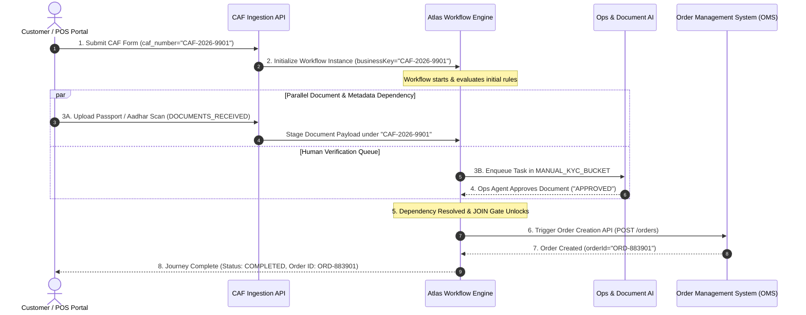
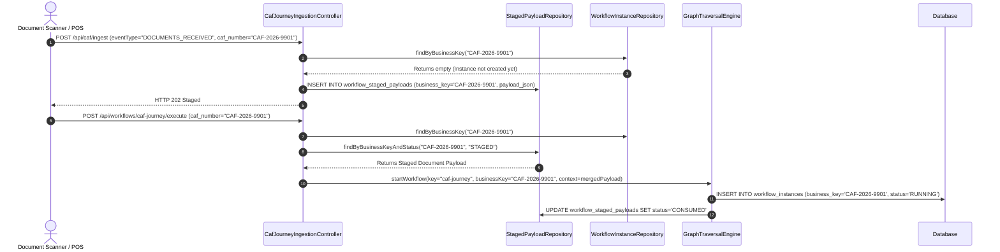
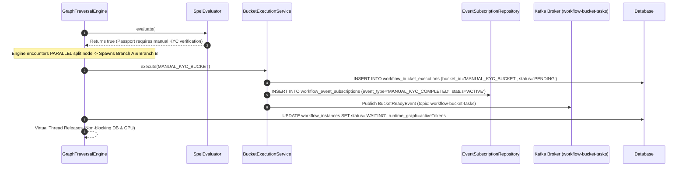
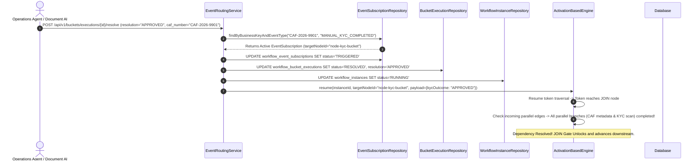
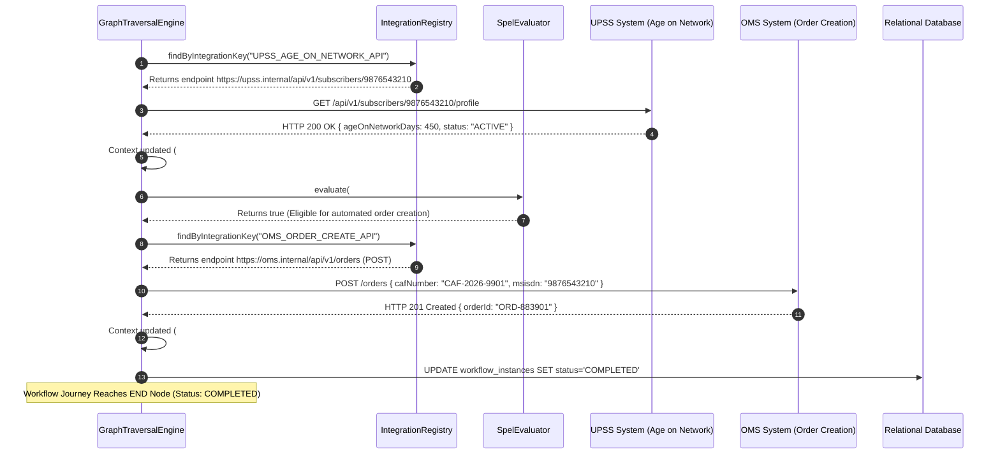

# Technical Low-Level Design (LLD): Atlas State Machine & Workflow Engine

This Low-Level Design (LLD) document provides technical specifications, multi-zoom-level execution flows, entity DDL schemas, class contracts, execution algorithms, integration patterns, error handling strategies, and REST API contracts for building the **Atlas State Machine & Workflow Engine**.

---

## 1. End-to-End Workflow Flow: CAF Journey & Document Dependency Resolution

To understand how the workflow engine operates in practice, consider a telecom **Customer Acquisition Form (CAF)** activation journey. The journey handles CAF submission, out-of-order document upload staging, dependency resolution between metadata and biometric documents, human review queues (buckets), external system integration, and automated **Order Creation**.

---

### 1.1 Zoom Level 1: Macro Sequence Diagram (High-Level 30,000 ft View)

This macro diagram shows the high-level operational milestones across major system boundaries without overwhelming low-level code mechanics.



---

### 1.2 Zoom Level 2: Micro Phase-by-Phase Technical Sequence Diagrams

To provide 1-to-1 clarity for developers, the end-to-end execution flow is broken down into four detailed technical phases:

---

#### Phase 2A: CAF Initiation & Out-of-Order Document Staging

In telecom journeys, document uploads (e.g. document scanner scans) frequently arrive asynchronously *before* or *during* the main CAF submission API call. The engine handles this using `StagedPayload` and `CafJourneyIngestionService`.



---

#### Phase 2B: Parallel Dependency Branching & Bucket Suspension

Once initialized, the workflow evaluates business rules and forks into parallel branches requiring both **Document Received verification** (`MANUAL_KYC_BUCKET`) and **Metadata Validation**.



---

#### Phase 2C: Async Event Correlation, Dependency Resolution & Resumption

When the Ops agent reviews the document scan or when an external Document AI completes processing, an asynchronous event is fired matching `businessKey = "CAF-2026-9901"`. `EventRoutingService` correlates the event, updates statuses, resolves dependencies, and unlocks the `JOIN` gate.



---

#### Phase 2D: External System Integration & Order Creation Command Execution

With dependencies resolved, the engine executes external REST integrations (fetching Age on Network from UPSS) and triggers automated **Order Creation** in the Order Management System (OMS).



---

### 1.3 Step-by-Step Narrative: CAF & Document Dependency Journey

1. **Out-of-Order Document Staging (`Phase 2A`)**:
   - A customer scans their passport at a POS kiosk. The Document Scanner posts `DOCUMENTS_RECEIVED` payload with `caf_number = "CAF-2026-9901"`.
   - Because the main CAF submission API has not executed yet, `CafJourneyIngestionService` stages the payload in `workflow_staged_payloads`.
   - Minutes later, the customer submits the CAF form via the web portal. The engine reads the staged document payload, initializes `WorkflowInstance`, and sets status to `RUNNING`.

2. **Parallel Dependency Branching & Suspension (`Phase 2B`)**:
   - Node `rule-verify-id` evaluates `#context['idType'] == 'PASSPORT'` via `SpelEvaluator`. Since passport verification requires manual biometric check, execution forks at a `PARALLEL` split into two branches:
     - **Branch A**: Enqueues `MANUAL_KYC_BUCKET` in `workflow_bucket_executions` and registers an active event subscription (`event_type = 'MANUAL_KYC_COMPLETED'`).
     - **Branch B**: Validates customer metadata and plan entitlement.
   - The instance enters `WAITING` status, releasing the Virtual Thread without blocking OS CPU resources.

3. **Dependency Resolution & Resumption (`Phase 2C`)**:
   - An Operations agent inspects the passport scan on the Ops Portal and clicks **Approve**.
   - The portal sends `POST /api/v1/buckets/executions/{id}/resolve` with `{ "resolution": "APPROVED" }`.
   - `EventRoutingService` matches `business_key = "CAF-2026-9901"`, marks the `EventSubscription` as `TRIGGERED`, updates bucket execution to `RESOLVED`, and resumes `ActivationBasedEngine`.
   - Token A advances to the `JOIN` node and verifies that Branch B (metadata validation) has also completed. Both dependencies are satisfied—the `JOIN` gate unlocks!

4. **External Call & Order Creation (`Phase 2D`)**:
   - The engine calls UPSS (`UPSS_AGE_ON_NETWORK_API`) via `IntegrationRegistry` to fetch subscriber age on network (450 days).
   - Node `dec-check-eligibility` evaluates `#context['ageOnNetworkDays'] >= 90` to `true`.
   - Node `cmd-trigger-order-create` dispatches a REST `POST` request to OMS (`OMS_ORDER_CREATE_API`) with `X-Idempotency-Key: CAF-2026-9901`.
   - OMS returns `orderId = "ORD-883901"`. Context is updated, and the workflow terminates cleanly at the `END` node with status `COMPLETED`.

---

### 1.4 Role Breakdown of Engine Components Used in the Flow

| Component Name | Primary Role in the Journey | Key Database Table / Class |
| :--- | :--- | :--- |
| **`CafJourneyIngestionController`** | Entry point receiving initial REST API submissions and out-of-order document uploads. | Controller Class |
| **`StagedPayloadRepository`** | Stores out-of-order document uploads staged under `business_key` prior to workflow initialization. | `workflow_staged_payloads` |
| **`WorkflowInstance`** | Stores runtime execution state, context variables (`#context`), and active node pointers. | `workflow_instances` |
| **`GraphTraversalEngine`** | Main execution orchestrator managing graph walking and node transitions. | `GraphTraversalEngine.java` |
| **`ActivationBasedEngine`** | Token propagation engine managing branch execution and parallel/join nodes. | `ActivationBasedEngine.java` |
| **`SpelEvaluator`** | Evaluates rules (`#context['idType'] == 'PASSPORT'`) and edge conditions securely using SpEL. | `SpelEvaluator.java` |
| **`BucketExecutionService`** | Creates and manages human review task queues (`MANUAL_KYC_BUCKET`). | `workflow_bucket_executions` |
| **`EventRoutingService`** | Correlates incoming resolution events (`caf_number`) and wakes up suspended instances. | `workflow_event_subscriptions` |
| **`IntegrationRegistry`** | Central catalog storing endpoint URLs, headers, and timeouts for UPSS and OMS APIs. | `workflow_integration_registry` |
| **`HttpRestCommand`** | Executes REST API requests to external systems (UPSS and OMS) and maps JSON responses. | `WorkflowCommand.java` |
| **`TaskRecorder`** | Records step-by-step audit logs for every node execution. | `workflow_task_instances` |

---

## 2. Relational Database Schema & Data Models

All tables use the `workflow_` prefix to enforce namespace isolation in enterprise shared relational databases (Oracle 19c / PostgreSQL).

```sql
-- 1. Metadata Root Table
CREATE TABLE workflow_definitions (
    workflow_definition_pk VARCHAR2(36) NOT NULL,
    wf_key VARCHAR2(100) NOT NULL,
    name VARCHAR2(255) NOT NULL,
    description VARCHAR2(1000),
    active_version NUMBER(10) DEFAULT 1 NOT NULL,
    circle_id NUMBER(10),
    active NUMBER(1) DEFAULT 1 NOT NULL,
    created_at TIMESTAMP DEFAULT CURRENT_TIMESTAMP NOT NULL,
    updated_at TIMESTAMP DEFAULT CURRENT_TIMESTAMP NOT NULL,
    CONSTRAINT pk_workflow_def PRIMARY KEY (workflow_definition_pk),
    CONSTRAINT uk_workflow_def_key UNIQUE (wf_key)
);

-- 2. Immutable Canvas Graph Snapshots
CREATE TABLE workflow_versions (
    workflow_version_pk VARCHAR2(36) NOT NULL,
    workflow_definition_id VARCHAR2(36) NOT NULL,
    version NUMBER(10) NOT NULL,
    status VARCHAR2(20) NOT NULL, -- DRAFT, REVIEW, APPROVED, PUBLISHED, ARCHIVED
    definition_json CLOB NOT NULL, -- Serialized WorkflowGraphDto
    created_by VARCHAR2(100),
    updated_by VARCHAR2(100),
    circle_id NUMBER(10),
    created_at TIMESTAMP DEFAULT CURRENT_TIMESTAMP NOT NULL,
    updated_at TIMESTAMP DEFAULT CURRENT_TIMESTAMP NOT NULL,
    CONSTRAINT pk_workflow_ver PRIMARY KEY (workflow_version_pk),
    CONSTRAINT fk_wf_ver_def FOREIGN KEY (workflow_definition_id) 
        REFERENCES workflow_definitions(workflow_definition_pk) ON DELETE CASCADE,
    CONSTRAINT uk_wf_def_ver UNIQUE (workflow_definition_id, version)
);

-- 3. Stateful Runtime Execution Instances
CREATE TABLE workflow_instances (
    workflow_instance_pk VARCHAR2(36) NOT NULL,
    workflow_key VARCHAR2(100) NOT NULL,
    version_id VARCHAR2(36) NOT NULL,
    version_number NUMBER(10) NOT NULL,
    business_key VARCHAR2(100) NOT NULL, -- e.g. Domain CAF Number (CAF-2026-9901)
    status VARCHAR2(30) NOT NULL, -- CREATED, RUNNING, WAITING, COMPLETED, FAILED, TERMINATED
    current_node_id VARCHAR2(100),
    circle_id NUMBER(10),
    opt_lock_version NUMBER(19) DEFAULT 0 NOT NULL,
    serialized_context CLOB, -- JSON Map<String, Object>
    runtime_graph CLOB,     -- Token positions, active edge states
    created_at TIMESTAMP DEFAULT CURRENT_TIMESTAMP NOT NULL,
    updated_at TIMESTAMP DEFAULT CURRENT_TIMESTAMP NOT NULL,
    CONSTRAINT pk_workflow_inst PRIMARY KEY (workflow_instance_pk),
    CONSTRAINT fk_wf_inst_ver FOREIGN KEY (version_id) 
        REFERENCES workflow_versions(workflow_version_pk)
);
CREATE INDEX idx_wf_inst_bizkey ON workflow_instances(business_key);
CREATE INDEX idx_wf_inst_status ON workflow_instances(status);

-- 4. Integration Registry Table (Decoupled Endpoint Configurations)
CREATE TABLE workflow_integration_registry (
    integration_pk VARCHAR2(36) NOT NULL,
    integration_key VARCHAR2(100) NOT NULL, -- e.g. UPSS_AGE_ON_NETWORK_API, OMS_ORDER_CREATE_API
    name VARCHAR2(200) NOT NULL,
    provider_type VARCHAR2(20) NOT NULL, -- REST, DB, CONFIG
    endpoint_url VARCHAR2(500),
    method VARCHAR2(10), -- GET, POST
    headers_json VARCHAR2(2000),
    request_template VARCHAR2(2000),
    timeout_ms NUMBER(10) DEFAULT 5000,
    circle_id NUMBER(10),
    created_at TIMESTAMP DEFAULT CURRENT_TIMESTAMP NOT NULL,
    updated_at TIMESTAMP DEFAULT CURRENT_TIMESTAMP NOT NULL,
    CONSTRAINT pk_wf_int_reg PRIMARY KEY (integration_pk),
    CONSTRAINT uk_wf_int_key UNIQUE (integration_key)
);

-- 5. Out-of-Order Staged Payloads Table
CREATE TABLE workflow_staged_payloads (
    staged_payload_pk VARCHAR2(36) NOT NULL,
    business_key VARCHAR2(100) NOT NULL, -- e.g. CAF-2026-9901
    event_type VARCHAR2(100) NOT NULL,   -- e.g. DOCUMENTS_RECEIVED
    status VARCHAR2(30) DEFAULT 'STAGED' NOT NULL, -- STAGED, CONSUMED, EXPIRED
    payload_json CLOB NOT NULL,
    created_at TIMESTAMP DEFAULT CURRENT_TIMESTAMP NOT NULL,
    updated_at TIMESTAMP DEFAULT CURRENT_TIMESTAMP NOT NULL,
    CONSTRAINT pk_wf_staged PRIMARY KEY (staged_payload_pk)
);
CREATE INDEX idx_staged_lookup ON workflow_staged_payloads(business_key, status);

-- 6. Step-Level Audit Ledger
CREATE TABLE workflow_task_instances (
    task_instance_pk VARCHAR2(255) NOT NULL, -- {instance_id}_{nodeId}_{counter}
    instance_id VARCHAR2(36) NOT NULL,
    task_type VARCHAR2(50) NOT NULL,
    label VARCHAR2(200),
    status VARCHAR2(30) NOT NULL, -- WAITING, COMPLETED, FAILED, SKIPPED
    input_data CLOB,
    output_data CLOB,
    started_at TIMESTAMP DEFAULT CURRENT_TIMESTAMP NOT NULL,
    completed_at TIMESTAMP,
    CONSTRAINT pk_wf_task_inst PRIMARY KEY (task_instance_pk),
    CONSTRAINT fk_wf_task_inst_parent FOREIGN KEY (instance_id) 
        REFERENCES workflow_instances(workflow_instance_pk) ON DELETE CASCADE
);

-- 7. Event Correlation Subscriptions
CREATE TABLE workflow_event_subscriptions (
    event_subscription_pk VARCHAR2(36) NOT NULL,
    instance_id VARCHAR2(36) NOT NULL,
    business_key VARCHAR2(100) NOT NULL, -- Correlated Business Key (e.g., caf_number)
    event_type VARCHAR2(100) NOT NULL,
    target_node_id VARCHAR2(100) NOT NULL,
    status VARCHAR2(30) DEFAULT 'ACTIVE' NOT NULL, -- ACTIVE, TRIGGERED, CANCELLED
    filter_attributes CLOB,
    created_at TIMESTAMP DEFAULT CURRENT_TIMESTAMP NOT NULL,
    CONSTRAINT pk_wf_evt_sub PRIMARY KEY (event_subscription_pk),
    CONSTRAINT fk_wf_evt_sub_inst FOREIGN KEY (instance_id) 
        REFERENCES workflow_instances(workflow_instance_pk) ON DELETE CASCADE
);
CREATE INDEX idx_evt_sub_lookup ON workflow_event_subscriptions(business_key, event_type, status);

-- 8. Human Task Queues (Buckets)
CREATE TABLE workflow_buckets (
    bucket_id VARCHAR2(50) NOT NULL,
    name VARCHAR2(150) NOT NULL,
    description VARCHAR2(500),
    priority VARCHAR2(20) DEFAULT 'MEDIUM' NOT NULL,
    sla_hours NUMBER(10) DEFAULT 24 NOT NULL,
    owner_group VARCHAR2(100) NOT NULL,
    active NUMBER(1) DEFAULT 1 NOT NULL,
    created_at TIMESTAMP DEFAULT CURRENT_TIMESTAMP NOT NULL,
    CONSTRAINT pk_wf_buckets PRIMARY KEY (bucket_id)
);

CREATE TABLE workflow_bucket_executions (
    bucket_execution_pk VARCHAR2(36) NOT NULL,
    instance_id VARCHAR2(36) NOT NULL,
    bucket_id VARCHAR2(50) NOT NULL,
    status VARCHAR2(30) DEFAULT 'PENDING' NOT NULL, -- PENDING, IN_REVIEW, RESOLVED
    assigned_to VARCHAR2(100),
    resolution VARCHAR2(50),
    resolution_notes VARCHAR2(1000),
    resolved_by VARCHAR2(100),
    created_at TIMESTAMP DEFAULT CURRENT_TIMESTAMP NOT NULL,
    completed_at TIMESTAMP,
    CONSTRAINT pk_wf_bucket_exec PRIMARY KEY (bucket_execution_pk),
    CONSTRAINT fk_wf_bexec_inst FOREIGN KEY (instance_id) 
        REFERENCES workflow_instances(workflow_instance_pk) ON DELETE CASCADE,
    CONSTRAINT fk_wf_bexec_bucket FOREIGN KEY (bucket_id) 
        REFERENCES workflow_buckets(bucket_id)
);

-- 9. Execution Telemetry Logs (Vertically Partitioned 1-to-1)
CREATE TABLE workflow_execution_logs (
    execution_log_pk VARCHAR2(36) NOT NULL,
    workflow_key VARCHAR2(100) NOT NULL,
    instance_id VARCHAR2(36) NOT NULL,
    status VARCHAR2(30) NOT NULL,
    step_count NUMBER(10) DEFAULT 0 NOT NULL,
    duration_ms NUMBER(19) DEFAULT 0 NOT NULL,
    started_at TIMESTAMP DEFAULT CURRENT_TIMESTAMP NOT NULL,
    completed_at TIMESTAMP,
    CONSTRAINT pk_wf_exec_log PRIMARY KEY (execution_log_pk)
);

CREATE TABLE workflow_execution_log_details (
    log_id VARCHAR2(36) NOT NULL,
    input_context_json CLOB,
    execution_trace_json CLOB,
    CONSTRAINT pk_wf_exec_log_det PRIMARY KEY (log_id),
    CONSTRAINT fk_wf_exec_log_det_pk FOREIGN KEY (log_id) 
        REFERENCES workflow_execution_logs(execution_log_pk) ON DELETE CASCADE
);
```

---

## 3. External System Integration & Domain-Key Correlation

External systems interact using domain business keys (`businessKey` / `caf_number`, e.g., `CAF-2026-9901`). The engine maps external identifiers to internal execution instances via `workflow_event_subscriptions`, ensuring zero internal engine UUID leakage to external microservices.

---

## 4. Execution Engine Design & Traversal Mechanics

### 4.1 Activation-Based DAG Traversal Algorithm

```java
public class ActivationBasedEngine {

    public TraversalResult executeDag(CompiledWorkflowGraph graph, TraversalExecutionState state) {
        Map<String, Object> runtimeGraph = state.getRuntimeGraph();
        Set<String> activeTokens = state.getActiveTokens(); 
        Set<String> traversedEdges = state.getTraversedEdges();

        while (!activeTokens.isEmpty()) {
            // Step 1: Pop active token
            String currentNodeId = activeTokens.iterator().next();
            activeTokens.remove(currentNodeId);
            WorkflowNodeDto node = graph.getNodeMap().get(currentNodeId);

            // Step 2: Handle JOIN Synchronization (AND Gateway)
            if ("JOIN".equals(node.getType())) {
                List<WorkflowEdgeDto> incoming = graph.getIncomingEdges(currentNodeId);
                boolean allArrived = incoming.stream().allMatch(e -> traversedEdges.contains(e.getId()));
                if (!allArrived) continue; 
            }

            // Step 3: Execute node strategy & check for suspension
            NodeExecutor executor = nodeExecutorRegistry.get(node.getType());
            StepRecordDto step = state.createStepRecord(node);
            NodeExecutionResult result = executor.execute(node, state, step, state.getTrace());

            if (result.isSuspended()) {
                state.persistSuspensionState(currentNodeId);
                return new TraversalResult(state.getTrace(), true, currentNodeId, node.getLabel(), result.getOutcomeBucketId(), runtimeGraph);
            }

            // Step 4: Evaluate outgoing SpEL edge conditions
            List<WorkflowEdgeDto> outgoing = graph.getOutgoingEdges(currentNodeId);
            for (WorkflowEdgeDto edge : outgoing) {
                if (evaluateEdgeCondition(edge, graph, state.getContext())) {
                    traversedEdges.add(edge.getId());
                    activeTokens.add(edge.getTarget());
                    if ("DECISION".equals(node.getType())) break; 
                }
            }
        }
        return new TraversalResult(state.getTrace(), false, null, null, null, runtimeGraph);
    }
}
```

---

## 5. Bucket Movement & Task Queue Management

### 5.1 Parallel Bucket Execution Paths & Inactive Auto-Bypass

- **Parallel Buckets**: Parallel splits spawn independent `workflow_bucket_executions` and `workflow_event_subscriptions` rows. Tokens halt at `JOIN` nodes until all parallel bucket branches resolve.
- **Inactive Bucket Auto-Bypass**: If `workflow_buckets.active == 0`, `BucketNodeExecutor` skips creating workload rows, populates `#context['bucketOutcome'] = 'AUTO_APPROVED'`, logs step status as `SKIPPED`, and continues graph walking immediately.

---

## 6. SpEL Rules Engine & Security Hardening

SpEL expressions use `SimpleEvaluationContext` to block reflection (`T(java.lang.Runtime)...`) and limit scope to `#context`.

```java
public static SimpleEvaluationContext createEvaluationContext(Map<String, Object> context) {
    Map<String, Object> root = new HashMap<>(context);
    root.put("context", context);

    return SimpleEvaluationContext
            .forPropertyAccessors(new MapAccessor(), DataBindingPropertyAccessor.forReadOnlyAccess())
            .withRootObject(root)
            .build();
}
```

---

## 7. Integration Registry & Practical Example

`IntegrationRegistry` decouples HTTP URLs, authentication headers, and timeouts from canvas nodes. Practical integrations include fetching "Age on Network" from UPSS and dispatching `order_create` requests to OMS.

---

## 8. Error Handling, Retries & Fallback Strategy

Automated external calls (`COMMAND` nodes) can fail due to network timeouts, service degradation, or HTTP errors.

```mermaid
flowchart TD
    A[COMMAND Node Invocation] --> B[Execute External REST API]
    B -->|HTTP 200 OK| C[Map Response Payload to Context]
    B -->|HTTP 5xx / Timeout| D{Spring @Retryable Check}
    D -->|Retries < 3| E[Wait Backoff Delay 200ms * 1.5 & Retry]
    E --> B
    D -->|Max Retries Exceeded| F[Populate #context['error'] = 'TIMEOUT_EXCEEDED']
    F --> G{Canvas Has Fallback Edge?}
    G -->|Yes: #context['error'] != null| H[Route to Fallback Node / Fallback Bucket]
    G -->|No| I[Mark Instance Status = FAILED & Stop Traversal]
```

---

## 9. Optimistic Concurrency Control & Self-Healing Retries

In high-throughput environments, multiple external callbacks or ops bucket resolutions may arrive simultaneously for the same `business_key`.

```java
@Service
public class ExecutionService {

    @Retryable(
        retryFor = { ObjectOptimisticLockingFailureException.class, OptimisticLockException.class },
        maxAttempts = 3,
        backoff = @Backoff(delay = 100, multiplier = 2.0)
    )
    @Transactional
    public ExecutionLogDto resume(String instanceId, Map<String, Object> additionalContext) {
        WorkflowInstance instance = instanceRepository.findById(instanceId).orElseThrow();
        return processResume(instance, additionalContext);
    }
}
```

---

## 10. Engine Safeguards & Infinite Loop Circuit Breaker

To protect the JVM from infinite execution loops caused by cyclic/faulty canvas graphs (e.g. Node A $\rightarrow$ Node B $\rightarrow$ Node A), `GraphTraversalEngine` enforces a step threshold.

```java
public class GraphTraversalEngine {
    private static final int MAX_STEPS = 200; // Circuit breaker limit

    public TraversalResult traverse(...) {
        int stepCounter = 0;
        while (!activeTokens.isEmpty()) {
            stepCounter++;
            if (stepCounter > MAX_STEPS) {
                log.error("Circuit breaker triggered! Instance {} exceeded MAX_STEPS ({})", instanceId, MAX_STEPS);
                state.markFailed("INFINITE_LOOP_DETECTED: Exceeded maximum permitted step count of 200");
                return new TraversalResult(state.getTrace(), false, null, null, null, runtimeGraph);
            }
        }
    }
}
```

---

## 11. Data Dictionary & Context Schema Validation

To guarantee type safety across workflow steps, `workflow_context_schemas` and `workflow_context_fields` define data constraints for workflow variables.

---

## 12. Exhaustive REST API Specifications (OpenAPI Contract)

### 12.1 Workflow Execution & Instance APIs

#### 1. Execute / Start Workflow
- **Endpoint**: `POST /api/workflows/{workflowKey}/execute`
- **Request Body**:
```json
{
  "businessKey": "CAF-2026-9901",
  "circleId": 10,
  "initialContext": {
    "customerMsisdn": "9876543210",
    "idType": "PASSPORT"
  }
}
```
- **Response `200 OK`**:
```json
{
  "instanceId": "inst-884012",
  "workflowKey": "caf-journey",
  "versionNumber": 2,
  "status": "WAITING",
  "currentNodeId": "node-kyc-bucket",
  "currentNodeLabel": "Manual KYC Review Bucket"
}
```

#### 2. Resume Suspended Instance
- **Endpoint**: `POST /api/instances/{id}/resume`
- **Request Body**:
```json
{
  "bucketOutcome": "APPROVED",
  "reviewerNotes": "Biometric passport verified"
}
```
- **Response `200 OK`**:
```json
{
  "executionLogId": "log-99201",
  "status": "COMPLETED",
  "stepCount": 7,
  "durationMs": 420
}
```

---

## 13. Summary & Developer Checklist

When implementing this engine, ensure the following core layers are verified:
1. **Schema Migrations**: Database DDLs for all 9 `workflow_*` tables with `@Version` lock columns.
2. **Graph Compilation**: Ahead-of-Time SpEL compilation (`SpelCompilerMode.IMMEDIATE`) in Caffeine L1 cache.
3. **Execution Engine**: Virtual Thread dispatching with token propagation (`ActivationBasedEngine`).
4. **Bucket Management**: Workload queue transitions (`PENDING` $\rightarrow$ `IN_REVIEW` $\rightarrow$ `RESOLVED`), parallel bucket JOIN convergence, and inactive bucket auto-bypass.
5. **Resilience & Security**: Security-hardened `SimpleEvaluationContext`, Spring `@Retryable` optimistic lock self-healing, `MAX_STEPS = 200` circuit breaker, and Kafka DLQ recovery.
