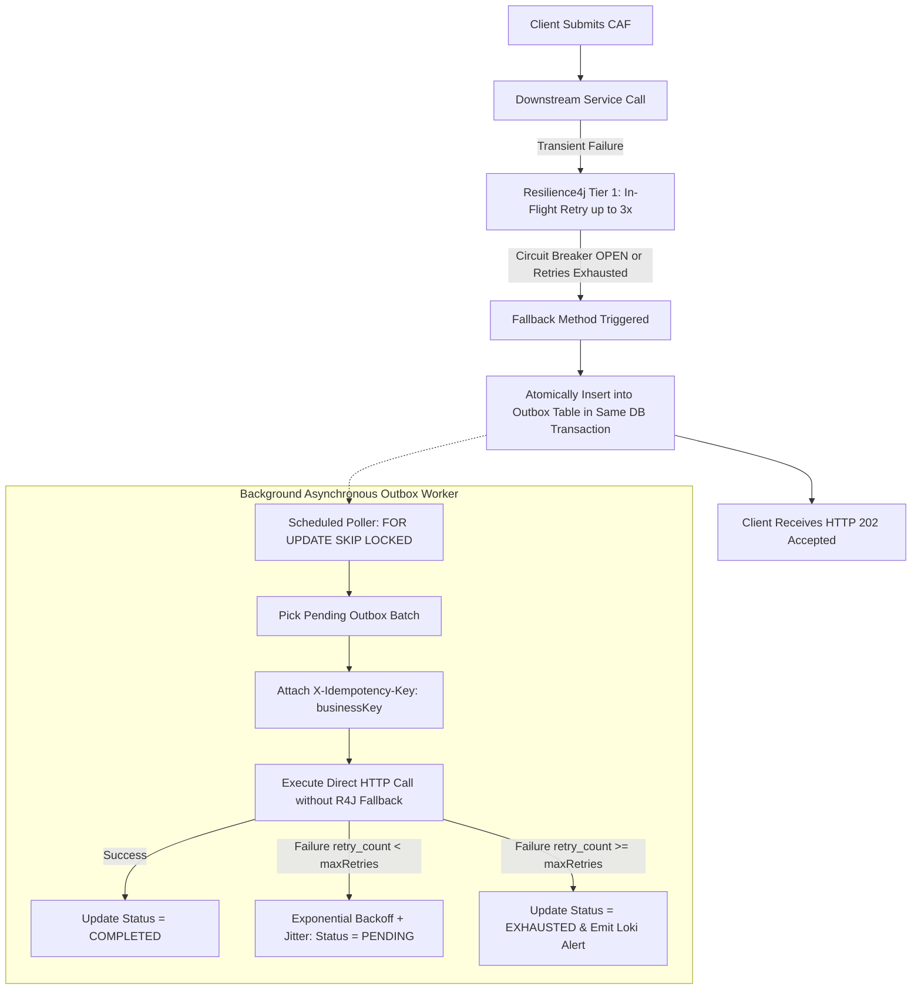
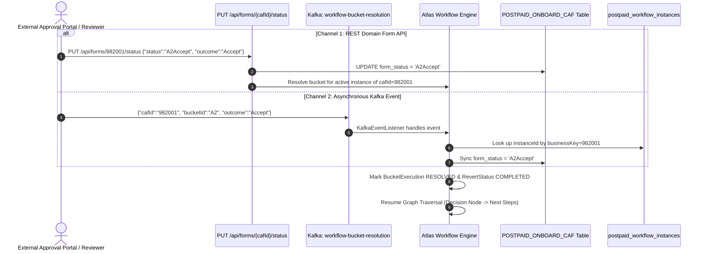

# Workflow External Resolution, Recovery & Database Operations Guide

## 1. System Overview & Executive Summary

In distributed telecom and enterprise customer journeys (such as Postpaid Customer Acquisition Forms / CAF), long-running workflows orchestrate both automated microservice calls and human-in-the-loop review tasks. 

This document serves as the comprehensive technical guide for:
1. **Two-Tier Resilience & Infinite Retry Prevention**: How the outbox engine and Resilience4j prevent cascading thread starvation, duplicate executions, and infinite loops.
2. **External Workflow Resolution via Business Key (`cafId`)**: Why external portals cannot be expected to know internal engine UUIDs (`instanceId`), and how the engine enables resolution via REST and Kafka using only `cafId`.
3. **The Architectural Distinction**: Why domain APIs use `status` while workflow APIs use `outcome`, and how both layers synchronize.
4. **Self-Healing & Network Glitch Recovery**: How the system detects and recovers from lost Kafka events or dropped webhooks using automated reconciliation pollers.
5. **Database Table-Level Operations**: Concrete SQL scripts for unsticking, soft-cancelling, and hard-purging both **bucket** and **non-bucket** workflows.

---

## 2. Two-Tier Resilience: Dedup & Infinite Retry Prevention

When the CAF Creation Service talks to downstream microservices (e.g. IMS, Order Management), it employs a Two-Tier Resilience architecture:



### 2.1 How Deduplication (Dedup) is Handled

1. **Idempotency Headers (`X-Idempotency-Key`)**:
   - The Outbox Processor attaches the unique business document key (e.g. `headers.set("X-Idempotency-Key", entry.getBusinessKey())`).
   - Downstream APIs use this header to identify duplicate execution attempts and safely ignore or return cached responses without double-charging or duplicate provisioning.
2. **Distributed Mutual Exclusion (`FOR UPDATE SKIP LOCKED`)**:
   - In multi-pod Kubernetes clusters, multiple background instances polling the database concurrently use:
     ```sql
     SELECT * FROM outbox_retry_queue 
     WHERE service_name = :serviceName AND status = 'PENDING' AND next_retry_at <= :now 
     ORDER BY created_at ASC 
     FOR UPDATE SKIP LOCKED;
     ```
   - Pod 1 locks its claimed batch; Pod 2 automatically skips those locked rows and claims the next set. This prevents duplicate processing across replicas.
3. **Atomic Single-Record Persistence**:
   - Outbox rows are written in the same database transaction (`@Transactional`) as the business entity. It is impossible to write duplicate outbox entries for the same failure event.

### 2.2 Preventing Infinite Retries and Fallback Loops

1. **Separation of Original vs. Outbox Retry Call**:
   - **Crucial Rule**: The outbox worker **must not** call the method annotated with Resilience4j `@CircuitBreaker` / `@Retry`.
   - If the outbox worker invoked the Resilience4j-annotated method, downstream failures would trigger the fallback method again, creating a **new duplicate row** in the outbox table on every poll and causing an **infinite fallback loop**.
   - Instead, `OutboxProcessorService` calls raw `restTemplate.exchange()` directly and updates retry counters in the existing database row.
2. **Bounded Retry Cap & Terminal `EXHAUSTED` State**:
   - Each service has a configured maximum retry limit (`max_retries`, e.g., 5 for IMS, 3 for OM).
   - When `retry_count + 1 >= max_retries`, the entry's status permanently transitions to `EXHAUSTED`.
   - The polling query strictly filters `WHERE status = 'PENDING'`. Once marked `EXHAUSTED` (or `COMPLETED`), the worker **never polls or retries the row again**.
3. **Structured Alerting**:
   - Upon transition to `EXHAUSTED`, a structured log (`ALERT_OUTBOX_EXHAUSTED`) is pushed to Grafana Loki, alerting operations via PagerDuty for human review.

---

## 3. External Bucket Resolution via Business Key (`cafId`)

### 3.1 The Problem: Internal Engine UUIDs vs. External Systems

When a workflow halts at a human review node (`BUCKET`, e.g. `A2` or `PREMIUM_APPROVAL`):
- The engine generates an internal UUID for the workflow instance (e.g., `376ed6dd-4af8-47df-bb8a-496cf7a96d5f`).
- However, external approval portals, third-party verifiers, and CRMs **only know the customer document key (`cafId` / `businessKey`)**.
- Forcing external systems to store and send internal instance UUIDs leaks engine internals and introduces unnecessary integration fragility.

### 3.2 Solution: Unified Resolution by `cafId`

The engine natively resolves pending bucket tasks using **only `cafId`** across both REST and Kafka channels.



---

### 3.3 Channel 1: External REST API (`PUT /api/forms/{cafId}/status`)

This is the primary synchronous endpoint for external review portals:

- **Method**: `PUT`
- **URL**: `http://localhost:9091/api/forms/{cafId}/status`
- **Headers**: `Content-Type: application/json`

#### Request Payload (Accept):
```json
{
  "status": "A2Accept",
  "outcome": "Accept",
  "resolvedBy": "external-approval-portal",
  "notes": "Identity and address verified"
}
```

#### Request Payload (Reject):
```json
{
  "status": "A2Reject",
  "outcome": "Reject",
  "resolvedBy": "external-approval-portal",
  "notes": "Failed address verification"
}
```

#### cURL Command Example:
```bash
curl -X PUT "http://localhost:9091/api/forms/982001/status" \
  -H "Content-Type: application/json" \
  -d '{
    "status": "A2Accept",
    "outcome": "Accept",
    "resolvedBy": "operator_john",
    "notes": "Documents verified successfully"
  }'
```

#### Engine Behavior:
1. Updates `POSTPAID_ONBOARD_CAF` where `caf_id = 982001` with `form_status = 'A2Accept'`.
2. Locates the active `WAITING` workflow execution associated with `cafId = 982001`.
3. Identifies the pending bucket (`A2`).
4. Invokes `BucketResolutionService.resolveBucket()` to mark tasks resolved and resume traversal.
5. Returns the updated `CustomerFormDto` with HTTP `200 OK`.

---

### 3.4 Channel 2: Asynchronous Kafka Resolution (`workflow-bucket-resolution`)

For event-driven microservices, third-party webhooks, or asynchronous verification systems:

- **Kafka Topic**: `workflow-bucket-resolution`
- **Consumer Group**: `atlas-workflow-group`

#### Kafka Event Payload:
```json
{
  "cafId": "982001",
  "bucketId": "A2",
  "outcome": "Accept",
  "resolvedBy": "external-verification-service@telecom.com",
  "resolutionNotes": "Biometric verification successful"
}
```
*(Note: You can also use `"businessKey": "982001"` instead of `"cafId"` — both are supported).*

#### CLI Producer Test Command:
```bash
wsl kafka-console-producer.sh --bootstrap-server localhost:9092 --topic workflow-bucket-resolution <<EOF
{
  "cafId": "982001",
  "bucketId": "A2",
  "outcome": "Accept",
  "resolvedBy": "ExternalConsole"
}
EOF
```

#### Engine Behavior (`KafkaEventListener.java`):
1. Detects that `instanceId` is not provided.
2. Automatically looks up the active instance:
   ```java
   String key = event.getBusinessKey() != null ? event.getBusinessKey() : event.getCafId();
   String instanceId = workflowInstanceRepository
           .findFirstByBusinessKeyOrderByCreatedAtDesc(key)
           .map(WorkflowInstance::getId)
           .orElseThrow(() -> new IllegalArgumentException("No workflow found for cafId: " + key));
   ```
3. Delegates to `BucketResolutionService.resolveBucket(instanceId, bucketId, outcome, resolvedBy, notes)`.
4. Updates `POSTPAID_ONBOARD_CAF`, marks audit rows `COMPLETED`, and advances the workflow.

---

## 4. Domain Model (`status`) vs. State Machine Model (`outcome`)

| Dimension | `PUT /api/forms/{cafId}/status` | Kafka / `BucketResolutionService` |
| :--- | :--- | :--- |
| **Architectural Layer** | **Domain Entity Layer** | **Workflow State Machine Layer** |
| **Target Entity** | Database row (`POSTPAID_ONBOARD_CAF`) | Graph Node Edge Transition |
| **Primary Concept** | **`status`** (e.g. `A2 Pending`, `A2Accept`) | **`outcome`** (e.g. `Accept`, `Reject`, `Park`) |
| **Audit Attributes** | Passed in payload or defaulted | Required (`resolvedBy`, `notes`) |

### Synchronization Between Layers
- When `PUT /api/forms/{cafId}/status` receives `status: "A2Accept"`, it strips the bucket prefix or reads `outcome: "Accept"` and injects `context.lastOutcome = "Accept"` and `context.form_status = "A2Accept"` into the state machine.
- Downstream decision nodes can route edges based on either SpEL expression:
  - `context.lastOutcome == 'Accept'`
  - `context.form_status == 'A2Accept'`

---

## 5. End-to-End Verification Test Case

A live end-to-end integration test is maintained in:
[`CafBucketResolutionApiIntegrationTest.java`](file:///c:/Users/hemant/Desktop/Projects/state-machine-engine/vth-workflow-service/src/test/java/com/vi/atlas/workflow/service/CafBucketResolutionApiIntegrationTest.java)

### Graph Topology
```
[START: Start Onboarding]
       │
       ▼
[BUCKET: bucket-a2-node (bucketId='A2')]  <-- Halts traversal, sets status = 'A2 Pending'
       │
       ▼
[DECISION: decision-1 (Evaluate Outcome)]
       ├────── "context.lastOutcome == 'Accept'" ──────► [END: end-approved]
       └────── "context.lastOutcome == 'Reject'" ──────► [END: end-rejected]
```

### Verified Test Scenarios

1. **`testExternalApiAcceptUsingCafId`**:
   - Starts workflow with `cafId = 982001`.
   - Workflow suspends at `bucket-a2-node` (`WAITING`). Form status = `A2 Pending`.
   - Sends HTTP `PUT /api/forms/982001/status` with `{"status": "A2Accept", "outcome": "Accept"}`.
   - Assert: HTTP 200 OK, instance status = `COMPLETED`, outcome node = `end-approved`.
2. **`testExternalApiRejectUsingCafId`**:
   - Starts workflow with `cafId = 982002`.
   - Sends HTTP `PUT /api/forms/982002/status` with `{"status": "A2Reject", "outcome": "Reject"}`.
   - Assert: HTTP 200 OK, instance status = `COMPLETED`, outcome node = `end-rejected`.
3. **`testEventApiResolutionUsingCafId`**:
   - Starts workflow with `cafId = 982003`.
   - Emits event via `POST /api/events` with `businessKey = 982003` and `eventType = A2`.
   - Assert: Instance resumes and completes at `end-approved`.

---

## 6. Self-Healing & Network Glitch Recovery

### 6.1 The Problem
An external operator marks a customer form as approved in the CRM or database, but:
- The Kafka publish command fails due to a network glitch.
- The webhook endpoint times out or drops the connection.
- The workflow engine was restarting during message delivery.

Result: The business form shows `A2Accept`, but the workflow remains stuck in `WAITING` at bucket `A2`.

### 6.2 The Solution: Automated Reconciliation Sweeper

The engine runs a scheduled background sweeper ([`FormApprovalScheduler.java`](file:///c:/Users/hemant/Desktop/Projects/state-machine-engine/vth-workflow-service/src/main/java/com/vi/atlas/workflow/scheduler/FormApprovalScheduler.java)):

```java
@Component
public class FormApprovalScheduler {

    // Runs every 5 minutes (300,000 ms)
    @Scheduled(fixedDelay = 300000)
    public void pollExternalApprovals() {
        // 1. Find all workflow instances currently WAITING
        List<WorkflowInstance> waitingInstances = instanceRepository.findByStatusOrderByCreatedAtDesc(WorkflowInstanceStatus.WAITING);

        for (WorkflowInstance instance : waitingInstances) {
            // 2. Locate active pending RevertStatus to find expected bucketId (e.g. "A2")
            // 3. Inspect CustomerForm in database for this cafId
            CustomerForm form = customerFormRepository.findById(cafId).orElse(null);

            // 4. Check if external status transitioned from "A2 Pending" to "A2Accept" or "A2Reject"
            if (form != null && !form.getFormStatus().equalsIgnoreCase(bucketId + " Pending")) {
                log.info("Self-Healing: Detected external status change for cafId={}: '{}'. Resuming workflow...",
                        cafId, form.getFormStatus());

                bucketResolutionService.resolveBucket(
                        instance.getId(),
                        bucketId,
                        deriveOutcome(form.getFormStatus()),
                        "SchedulerPoller",
                        "Self-healed from dropped event"
                );
            }
        }
    }
}
```

---

## 7. Database Table-Level Operations & Cleanup Guide

### 7.1 Database Entity & Table Reference

All workflow engine tables use the `postpaid_workflow_` prefix (except the customer document table):

| Entity Class | Table Name | Purpose |
| :--- | :--- | :--- |
| `CustomerForm` | `POSTPAID_ONBOARD_CAF` | Domain business record (`caf_id`, `form_status`) |
| `WorkflowInstance` | `postpaid_workflow_instances` | State machine parent instance (`status`, `current_node_id`) |
| `TaskInstance` | `postpaid_workflow_task_instances` | Individual node execution records |
| `EventSubscription` | `postpaid_workflow_event_subscriptions` | Active listening subscriptions waiting for events |
| `BucketExecution` | `postpaid_workflow_bucket_executions` | Workload tasks assigned to review buckets |
| `RevertStatus` | `postpaid_workflow_revert_status` | Audit trail for manual bucket transitions |
| `ExecutionLog` | `postpaid_workflow_execution_logs` | Run summary records |
| `ExecutionLogDetail`| `postpaid_workflow_execution_log_details` | Step-by-step diagnostic trace details |

---

### 7.2 Unsticking a Bucket Workflow

#### Option 1: Soft Update (Recommended — Triggers Automatic Engine Progression)
Because `FormApprovalScheduler` is continuously monitoring the database, simply updating the customer form table will cause the engine to self-heal and run all downstream nodes on the next cycle:

```sql
UPDATE POSTPAID_ONBOARD_CAF
SET form_status = 'A2Accept',
    updated_at = CURRENT_TIMESTAMP
WHERE caf_id = 982001; -- Replace with your CAF ID
```

#### Option 2: Full Multi-Table SQL Update (Emergency Manual Override)
If the engine is stopped or you need to forcibly advance the instance directly in SQL:

```sql
-- Parameters:
-- :instance_id  = '376ed6dd-4af8-47df-bb8a-496cf7a96d5f'
-- :caf_id       = 982001
-- :bucket_id    = 'A2'
-- :next_node_id = 'end-approved'

-- 1. Update Domain Form Status
UPDATE POSTPAID_ONBOARD_CAF
SET form_status = 'A2Accept',
    updated_at = CURRENT_TIMESTAMP
WHERE caf_id = :caf_id;

-- 2. Resolve Bucket Execution Workload Row
UPDATE postpaid_workflow_bucket_executions
SET status = 'RESOLVED',
    resolved_at = CURRENT_TIMESTAMP,
    resolved_by = 'DBA_Emergency_Fix',
    resolution_notes = 'Manually resolved in DB'
WHERE workflow_instance_id = :instance_id
  AND bucket_id = :bucket_id
  AND status = 'PENDING';

-- 3. Complete Audit Revert Trail
UPDATE postpaid_workflow_revert_status
SET status = 'COMPLETED',
    completed_at = CURRENT_TIMESTAMP,
    resolved_by = 'DBA_Emergency_Fix',
    resolution_notes = 'Audit completed via DB update'
WHERE workflow_instance_id = :instance_id
  AND bucket_id = :bucket_id
  AND status = 'PENDING';

-- 4. Mark Event Subscription as TRIGGERED
UPDATE postpaid_workflow_event_subscriptions
SET status = 'TRIGGERED',
    updated_at = CURRENT_TIMESTAMP
WHERE workflow_instance_id = :instance_id
  AND status = 'ACTIVE';

-- 5. Mark Suspended Task as COMPLETED
UPDATE postpaid_workflow_task_instances
SET status = 'COMPLETED',
    completed_at = CURRENT_TIMESTAMP
WHERE workflow_instance_id = :instance_id
  AND status = 'WAITING';

-- 6. Advance Parent Workflow Instance
UPDATE postpaid_workflow_instances
SET status = 'COMPLETED',
    current_node_id = :next_node_id,
    updated_at = CURRENT_TIMESTAMP
WHERE id = :instance_id;

COMMIT;
```

---

### 7.3 Unsticking a Non-Bucket Workflow

For workflows paused on generic events (`WAIT_EVENT`), asynchronous commands, or timers:

#### Method A: Advance via Event Bus (Recommended)
```bash
curl -X POST "http://localhost:9091/api/events" \
  -H "Content-Type: application/json" \
  -d '{
    "eventType": "PAYMENT_RECEIVED",
    "businessKey": "CAF-9901",
    "payload": {
      "paymentStatus": "SUCCESS",
      "amount": 499
    }
  }'
```

#### Method B: Direct SQL Advance
```sql
-- Parameters: :instance_id, :next_node_id

-- 1. Complete Active Task
UPDATE postpaid_workflow_task_instances
SET status = 'COMPLETED',
    completed_at = CURRENT_TIMESTAMP
WHERE workflow_instance_id = :instance_id
  AND status IN ('WAITING', 'RUNNING');

-- 2. Deactivate Event Subscription
UPDATE postpaid_workflow_event_subscriptions
SET status = 'TRIGGERED',
    updated_at = CURRENT_TIMESTAMP
WHERE workflow_instance_id = :instance_id
  AND status = 'ACTIVE';

-- 3. Complete Execution Log
UPDATE postpaid_workflow_execution_logs
SET status = 'COMPLETED',
    outcome_node_id = :next_node_id,
    completed_at = CURRENT_TIMESTAMP
WHERE instance_id = :instance_id
  AND status IN ('WAITING', 'RUNNING');

-- 4. Advance Parent Instance
UPDATE postpaid_workflow_instances
SET status = 'COMPLETED',
    current_node_id = :next_node_id,
    updated_at = CURRENT_TIMESTAMP
WHERE id = :instance_id;

COMMIT;
```

---

### 7.4 Generic DB Cleanup / Soft Cancellation (Terminating an Instance)

When an instance is corrupted, cancelled by a customer, or obsolete, cancel it gracefully without violating foreign key constraints:

```sql
-- Parameters: :instance_id

-- 1. Cancel Active Event Subscriptions
UPDATE postpaid_workflow_event_subscriptions
SET status = 'CANCELLED',
    updated_at = CURRENT_TIMESTAMP
WHERE workflow_instance_id = :instance_id
  AND status = 'ACTIVE';

-- 2. Fail Stuck Tasks
UPDATE postpaid_workflow_task_instances
SET status = 'FAILED',
    completed_at = CURRENT_TIMESTAMP
WHERE workflow_instance_id = :instance_id
  AND status IN ('WAITING', 'RUNNING');

-- 3. Fail Active Execution Logs
UPDATE postpaid_workflow_execution_logs
SET status = 'FAILED',
    error_message = 'Cancelled by administrator',
    completed_at = CURRENT_TIMESTAMP
WHERE instance_id = :instance_id
  AND status IN ('WAITING', 'RUNNING');

-- 4. Mark Instance as TERMINATED
UPDATE postpaid_workflow_instances
SET status = 'TERMINATED',
    updated_at = CURRENT_TIMESTAMP
WHERE id = :instance_id;

COMMIT;
```

---

### 7.5 Hard-Purge Script (Complete Deletion in Reverse FK Order)

To completely erase an instance and all child history from the database:

```sql
-- Parameters: :instance_id

-- 1. Execution log step details
DELETE FROM postpaid_workflow_execution_log_details
WHERE execution_log_id IN (
    SELECT id FROM postpaid_workflow_execution_logs WHERE instance_id = :instance_id
);

-- 2. Execution logs
DELETE FROM postpaid_workflow_execution_logs
WHERE instance_id = :instance_id;

-- 3. Task instances
DELETE FROM postpaid_workflow_task_instances
WHERE workflow_instance_id = :instance_id;

-- 4. Event subscriptions
DELETE FROM postpaid_workflow_event_subscriptions
WHERE workflow_instance_id = :instance_id;

-- 5. Bucket executions and revert audit records
DELETE FROM postpaid_workflow_bucket_executions
WHERE workflow_instance_id = :instance_id;

DELETE FROM postpaid_workflow_revert_status
WHERE workflow_instance_id = :instance_id;

-- 6. Parent workflow instance
DELETE FROM postpaid_workflow_instances
WHERE id = :instance_id;

COMMIT;
```

---

## 8. Summary of API Endpoints for Operations

| Action | HTTP Method | Endpoint | Key Parameters |
| :--- | :---: | :--- | :--- |
| **Resolve Bucket by CAF ID** | `PUT` | `/api/forms/{cafId}/status` | `{"status": "A2Accept", "outcome": "Accept"}` |
| **Resolve Bucket via Kafka** | Kafka Event | Topic: `workflow-bucket-resolution` | `{"cafId": "982001", "bucketId": "A2", "outcome": "Accept"}` |
| **Publish Inbound Event** | `POST` | `/api/events` | `{"eventType": "A2", "businessKey": "982001", "payload": {...}}` |
| **Direct Instance Resume** | `POST` | `/api/instances/{id}/resume` | Context JSON map |
| **Delete / Terminate Instance**| `DELETE` | `/api/instances/{id}` | Calls `executionService.terminateInstance(id)` |
| **View Audit Trail** | `GET` | `/api/instances/{id}/revert-status` | Returns list of `RevertStatusDto` |
