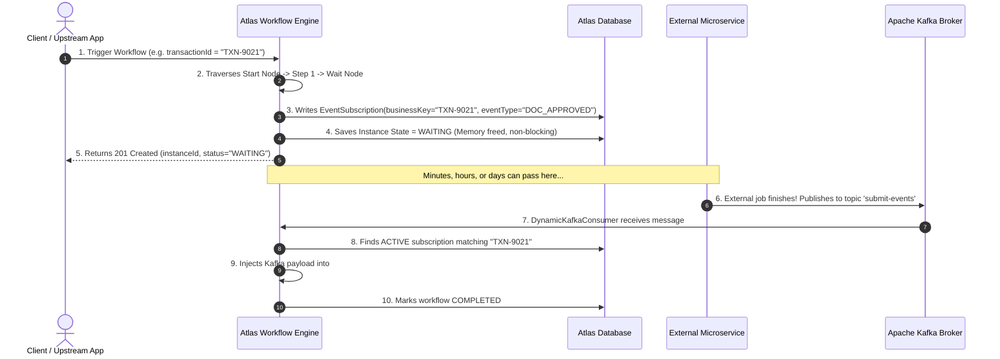

# Developer Guide: Building Asynchronous Kafka-Driven Workflows in Atlas

Welcome to the **Atlas State Machine Engine**! This guide is written for engineers who are new to the platform. It walks you through building an asynchronous, long-running workflow that pauses at a **Wait Event Node**, waits for an external service to complete some task, and resumes automatically when an event is published to **Apache Kafka**.

---

## Table of Contents
1. [Core Mental Model: How Async Workflows Work](#1-core-mental-model-how-async-workflows-work)
2. [The Heart of the System: Correlation ID Explained](#2-the-heart-of-the-system-correlation-id-explained)
3. [End-to-End Tutorial: From Zero to Resumption](#3-end-to-end-tutorial-from-zero-to-resumption)
   - [Step 1: Register the Event in Event Registry](#step-1-register-the-event-in-the-event-registry)
   - [Step 2: Design the Workflow](#step-2-design-the-workflow-in-the-designer)
   - [Step 3: Trigger the Workflow](#step-3-trigger-the-workflow)
   - [Step 4: Verify Suspended State](#step-4-verify-the-workflow-is-waiting)
   - [Step 5: Publish the Inbound Kafka Event](#step-5-publish-the-kafka-resumption-event)
   - [Step 6: Verify Completion & Context Propagation](#step-6-verify-workflow-resumption)
4. [How Downstream Nodes Access Inbound Event Data](#4-how-downstream-nodes-access-inbound-event-data)
5. [Troubleshooting & Verification Checklist](#5-troubleshooting--verification-checklist)

---

## 1. Core Mental Model: How Async Workflows Work

In modern distributed microservices, business journeys cannot execute in a single blocking HTTP request. A workflow frequently needs to **pause** and wait for an external action—such as:
* Waiting for a third-party KYC verification or credit bureau report.
* Waiting for a customer to enter an OTP on their phone.
* Waiting for a payment gateway callback or bank webhook.

Atlas handles this using the **Event-Driven Wait-and-Resume Pattern**:



---

## 2. The Heart of the System: Correlation ID Explained

### What is a Correlation ID?
When an external system produces an event onto a shared Kafka topic (e.g., `submit-events`), thousands of workflow instances might be waiting at the exact same time. 

> **The Correlation ID is the unique business token (e.g. `transactionId`, `orderId`, `cafId`) that tells the engine exactly *which* waiting workflow instance owns this incoming message.**

### The 3-Way Correlation Handshake

Correlation succeeds when these three values match:

```text
┌────────────────────────────────────────────────────────┐
│ 1. WORKFLOW TRIGGER (Instance Creation)                │
│    Trigger payload sets business identifier:           │
│    { "context": { "transactionId": "TXN-9021" } }      │
│    ↳ Atlas tags WorkflowInstance.businessKey = "TXN-9021"│
└──────────────────────────┬─────────────────────────────┘
                           │
                           ▼
┌────────────────────────────────────────────────────────┐
│ 2. WAIT NODE SUSPENSION                                │
│    Wait node creates DB record:                        │
│    EventSubscription(                                  │
│       businessKey = "TXN-9021",                        │
│       eventType   = "DOC_APPROVED"                     │
│    )                                                   │
└──────────────────────────▲─────────────────────────────┘
                           │ Matches!
                           ▼
┌────────────────────────────────────────────────────────┐
│ 3. INCOMING KAFKA EVENT (Topic: 'submit-events')       │
│    Kafka Message:                                      │
│    {                                                   │
│      "eventType": "DOC_APPROVED",                      │
│      "payload": {                                      │
│         "transactionId": "TXN-9021", ◄── Path Matches! │
│         "status": "APPROVED"                           │
│      }                                                 │
│    }                                                   │
│    Event Registry 'correlationKeyPath' = "payload.transactionId"│
│    ↳ Engine extracts key: "TXN-9021"                   │
└────────────────────────────────────────────────────────┘
```

#### What is `correlationKeyPath`?
It is a **dot-notation path** configured on the Event in the Event Registry that tells the engine where to find the correlation value inside the incoming Kafka JSON.

| If your incoming Kafka JSON is: | Set `correlationKeyPath` to: | Extracted Correlation ID: |
| :--- | :--- | :--- |
| `{"payload": {"transactionId": "TXN-101"}}` | `payload.transactionId` | `"TXN-101"` |
| `{"transactionId": "TXN-101"}` | `transactionId` | `"TXN-101"` |
| `{"data": {"order": {"id": "ORD-55"}}}` | `data.order.id` | `"ORD-55"` |

---

## 3. End-to-End Tutorial: From Zero to Resumption

### Step 1: Register the Event in the Event Registry

Before using an event in a workflow, declare it in the **Event Registry**.

1. Open the UI at **[http://localhost:3000/events](http://localhost:3000/events)** (or navigate to **Event Registry** in the sidebar).
2. Click **Register Event**.
3. Fill in the fields:
   - **Event Key**: `SUBMIT_DOCUMENT_EVENT` *(unique uppercase code)*
   - **Name**: `Submit Document Event`
   - **Kafka Topic Name**: `submit-events` *(the topic your external service will push to)*
   - **Correlation Key Path**: `payload.transactionId`
   - **Description**: `Triggered when external KYC service finishes document review`
4. Click **Save**.

> [!TIP]
> **Dynamic Topic Activation**: The moment you save an event with topic `submit-events`, the backend engine dynamically subscribes to that topic on the Kafka broker immediately. No server restart is needed!

---

### Step 2: Design the Workflow in the Designer

1. Open the UI at **[http://localhost:3000/workflows](http://localhost:3000/workflows)**.
2. Click **Create Workflow** and set the key to `ORDER_JOURNEY`.
3. In the canvas:
   - Drag a **Start Node** onto the canvas.
   - Drag a **Wait Event Node** (from the left sidebar catalog).
   - Drag an **End Node**.
   - Connect: `Start Node` $\rightarrow$ `Wait Event Node` $\rightarrow$ `End Node`.
4. Click on the **Wait Event Node** to open the properties drawer on the right:
   - Under **Event (from Event Registry)**, select `Submit Document Event (SUBMIT_DOCUMENT_EVENT)`.
   - The drawer will display:
     - *Topic: `submit-events`*
     - *Correlation Path: `payload.transactionId`*
5. Click **Save Workflow** and **Publish**.

---

### Step 3: Trigger the Workflow

Trigger the workflow via HTTP POST. Include your unique identifier (`transactionId`) in the payload:

```bash
curl -X POST http://localhost:9091/api/execute/ORDER_JOURNEY \
  -H "Content-Type: application/json" \
  -d '{
    "context": {
      "transactionId": "TXN-2026-9999",
      "customerName": "Alice Johnson",
      "plan": "UNLIMITED_5G"
    }
  }'
```

#### Engine Behavior on Trigger:
- The engine automatically resolves `businessKey = "TXN-2026-9999"` from `context.transactionId`.
- The engine executes `Start Node` $\rightarrow$ reaches `Wait Event Node`.
- The engine suspends execution and writes a record in table `workflow_event_subscriptions`:
  ```sql
  -- What the engine stores in the DB:
  business_key = 'TXN-2026-9999'
  event_type   = 'SUBMIT_DOCUMENT_EVENT'
  target_node  = 'wait_event-xxxx'
  status       = 'ACTIVE'
  ```
- **Response**:
  ```json
  {
    "instanceId": "9b1deb4d-3b7d-4bad-9bdd-2b0d7b3dcb6d",
    "workflowKey": "ORDER_JOURNEY",
    "status": "WAITING",
    "stepCount": 2
  }
  ```

---

### Step 4: Verify the Workflow is Waiting

You can verify the suspended instance in three ways:

1. **In the UI**: Go to **Running Instances** (`http://localhost:3000/instances`). You will see `ORDER_JOURNEY` in status `WAITING`, paused at your wait node.
2. **Via REST API**:
   ```bash
   curl http://localhost:9091/api/instances/9b1deb4d-3b7d-4bad-9bdd-2b0d7b3dcb6d/subscriptions
   ```
   *Returns the active subscription listening for `TXN-2026-9999`.*
3. **In the Database Console** (`http://localhost:9091/h2-console`):
   ```sql
   SELECT business_key, event_type, status, target_node_id 
   FROM workflow_event_subscriptions 
   WHERE status = 'ACTIVE';
   ```

---

### Step 5: Publish the Kafka Resumption Event

Now, simulate your external microservice completing its job by publishing an event to Kafka topic `submit-events`.

#### Payload Requirements:
1. `eventType`: Must match the registered event key (`SUBMIT_DOCUMENT_EVENT`).
2. Correlation field: Must match the path `payload.transactionId` and value (`TXN-2026-9999`).
3. Additional data: Any other fields in `payload` will be merged into the workflow's `#context`.

#### Option A: Publish using WSL / Linux Kafka CLI
```bash
wsl -d Debian bash -c '/home/alca/kafka_2.13-3.7.0/bin/kafka-console-producer.sh \
  --bootstrap-server 172.30.111.122:9092 \
  --topic submit-events'
```
*Paste this JSON and hit Enter:*
```json
{
  "eventType": "SUBMIT_DOCUMENT_EVENT",
  "payload": {
    "transactionId": "TXN-2026-9999",
    "verificationStatus": "PASSED",
    "reviewer": "agent_smith",
    "score": 98
  }
}
```

#### Option B: Publish using Python (`confluent-kafka` or `kafka-python`)
```python
import json
from kafka import KafkaProducer

producer = KafkaProducer(
    bootstrap_servers='172.30.111.122:9092',
    value_serializer=lambda v: json.dumps(v).encode('utf-8')
)

event = {
    "eventType": "SUBMIT_DOCUMENT_EVENT",
    "payload": {
        "transactionId": "TXN-2026-9999",
        "verificationStatus": "PASSED",
        "reviewer": "agent_smith",
        "score": 98
    }
}

producer.send('submit-events', value=event)
producer.flush()
print("Event published successfully!")
```

#### Option C: Publish using Java Spring Kafka
```java
@Autowired
private KafkaTemplate<String, Object> kafkaTemplate;

public void notifyAtlas(String transactionId) {
    Map<String, Object> event = Map.of(
        "eventType", "SUBMIT_DOCUMENT_EVENT",
        "payload", Map.of(
            "transactionId", transactionId,
            "verificationStatus", "PASSED",
            "reviewer", "agent_smith"
        )
    );
    kafkaTemplate.send("submit-events", transactionId, event);
}
```

---

### Step 6: Verify Workflow Resumption

As soon as the message lands on `submit-events`, the engine automatically:
1. Matches `payload.transactionId` (`"TXN-2026-9999"`) to the active DB subscription.
2. Marks the subscription as `TRIGGERED`.
3. Injects all incoming payload attributes (`verificationStatus`, `reviewer`, `score`) into the workflow context.
4. Resumes traversal from the wait node to the next connected nodes until reaching `END`.

#### Check Instance Status:
```bash
curl http://localhost:9091/api/instances/9b1deb4d-3b7d-4bad-9bdd-2b0d7b3dcb6d
```
*Status is now `COMPLETED`.*

---

## 4. How Downstream Nodes Access Inbound Event Data

**All attributes received in the Kafka event payload are merged directly into the shared `#context`.** Downstream nodes can use them immediately:

### 1. In Decision Nodes & Edge Rules (SpEL Expressions)
Create conditional edges based on what the external service sent:
```text
#context['verificationStatus'] == 'PASSED'
#context['score'] >= 80
#context['reviewer'] != null
```

### 2. In Command / REST Nodes (Parameter Templating)
Interpolate Kafka payload values into outbound HTTP or SMS commands:
```json
{
  "mobileNumber": "#context['customerPhone']",
  "message": "Hello, your KYC document was reviewed by #context['reviewer'] with status: #context['verificationStatus']"
}
```

---

## 5. Troubleshooting & Verification Checklist

| Symptom | Probable Cause | How to Verify & Fix |
| :--- | :--- | :--- |
| **Kafka message sent, but workflow stays in `WAITING`** | **Correlation ID mismatch** | Check DB: `SELECT business_key FROM workflow_event_subscriptions WHERE status = 'ACTIVE'`. Ensure the value extracted from `payload.transactionId` matches `business_key` exactly (check for extra spaces or case differences). |
| **Log says: "Cannot route event: missing eventType"** | **Missing event identifier** | Ensure your Kafka JSON either has top-level `"eventType": "YOUR_EVENT_KEY"`, or that the topic has a registered `EventDefinition` in the Event Registry. |
| **Log says: "No active subscriptions found"** | **Workflow not yet paused at wait node** | Ensure the workflow was actually triggered and reached the wait node *before* the Kafka event was published (or use the Out-of-Order Staging pattern if events arrive early). |
| **Topic not receiving messages** | **Topic name typo** | Verify `kafkaTopic` in the Event Registry matches the exact Kafka topic your producer is writing to. |

### Useful SQL Debugging Commands (H2 Console)
```sql
-- 1. View all currently suspended workflows and what they are waiting for:
SELECT s.business_key, s.event_type, s.target_node_id, s.status, i.workflow_key, i.id AS instance_id
FROM workflow_event_subscriptions s
JOIN workflow_instances i ON s.workflow_instance_id = i.id
WHERE s.status = 'ACTIVE';

-- 2. Inspect serialized context variables for an instance:
SELECT id, status, serialized_context 
FROM workflow_instances 
WHERE id = 'YOUR_INSTANCE_ID';
```

---

### Quick Reference Cheat Sheet

* **To Trigger Workflow**: `POST /api/execute/{workflowKey}` with `{"context": {"transactionId": "..."}}`.
* **To Register Event**: UI at `/events` $\rightarrow$ Set Event Key, Kafka Topic, and `payload.xxx` Correlation Path.
* **To Resume via Kafka**: Publish JSON containing `eventType` and `payload` with matching correlation field.
* **To Test Without Kafka**: You can also use the simulation endpoint:
  ```bash
  POST http://localhost:9091/api/events
  {
    "eventType": "SUBMIT_DOCUMENT_EVENT",
    "businessKey": "TXN-2026-9999",
    "payload": { "transactionId": "TXN-2026-9999", "status": "PASSED" }
  }
  ```
