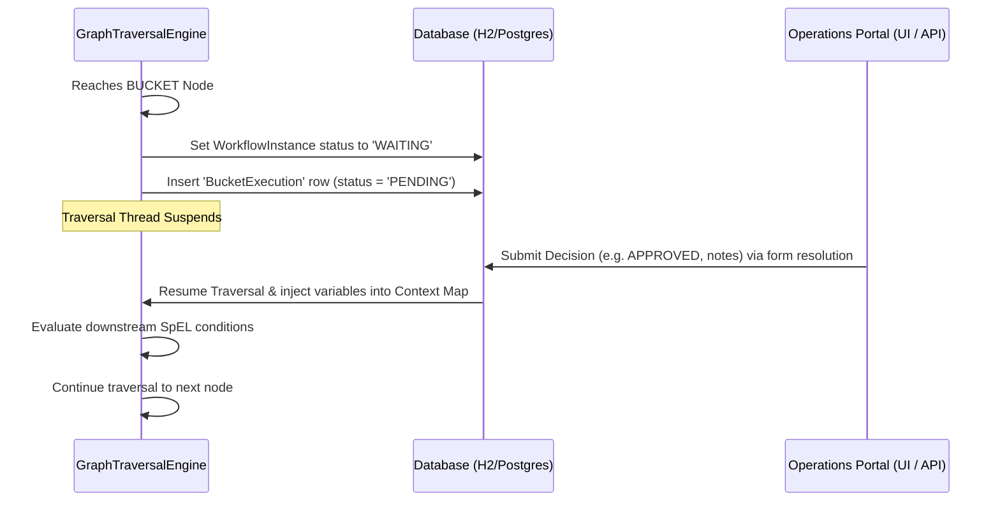

# Atlas Workflow Engine: Outcome Bucket Registry & Guide

This guide details the operation of the **Outcome Bucket Registry**, what happens when a workflow encounters a **Bucket Node**, and how you can route downstream flow branches based on bucket resolution results.

---

## 1. High-Level Registry Architecture

The Atlas workflow engine includes several metadata registries that define rules, operational buckets, integrations, and event schemas:

| Registry Name | Description | Key Column / Field | Role in Execution |
| :--- | :--- | :--- | :--- |
| **Rules Registry** | Reusable Spring SpEL expressions for validation or routing. | `rule_key` | Evaluated dynamically inside `RULE` nodes. |
| **Bucket Registry** | Operational queues for manual review, SLAs, and ownership. | `bucket_id` | Halts execution inside `BUCKET` nodes until resolved. |
| **Integration Registry**| Configurations for webhooks and downstream HTTP integrations. | `integration_pk`| Executed inside `INTEGRATION` / `API` nodes. |
| **Event Registry** | Inbound event topic and correlation schema definitions. | `event_type` | Matches pending wait subscriptions to resume nodes. |

---

## 2. Bucket Node Lifecycle: Detailed Traversal Suspension

When a workflow execution encounters a node of type `BUCKET`, the following sequence occurs within the traversal engine:



### Steps:
1. **Encounter & Suspension**:
   The `GraphTraversalEngine` halts the execution path at the target bucket node.
   - The `WorkflowInstance` status is transitioned to `WAITING`.
   - A `BucketExecution` row is written to the database with `status = 'PENDING'`, establishing the SLA timer, owner group, and priority.
2. **Operational Action**:
   The task sits in the operator's queue. A reviewer resolves the task (e.g., through the React UI Form panel or via a REST request to `/api/buckets/resolve`).
3. **Context Injection & Resumption**:
   When resolved, the backend:
   - Updates the `BucketExecution` status to `RESOLVED`.
   - Populates the workflow `Context Map` with resolution attributes.
   - Invokes `ExecutionService.resume()` to reactivate graph traversal from the suspended node.

---

## 3. Injected Context Variables

Upon bucket resolution, the following fields are merged into the workflow's instance context:

*   `context.lastOutcome`: The decision action value selected by the resolver (e.g., `"APPROVED"`, `"REJECTED"`, `"ESCALATED"`).
*   `context.lastBucketId`: The business key of the resolved bucket node (e.g., `"RISK_VERIFICATION"`).
*   `context.form_status`: Hardcoded to `"RESOLVED"` to signal form completion.
*   `context.notes`: The manual resolution comments provided by the operator.

### Example Context JSON Map:
```json
{
  "amount": 25000,
  "customerId": "CUST_9918",
  "customerName": "Acme Corp",
  "riskScore": 72.5,
  "lastOutcome": "APPROVED",
  "lastBucketId": "RISK_VERIFICATION",
  "form_status": "RESOLVED",
  "notes": "Reviewed financial statement logs and audited records. Valid business case."
}
```

---

## 4. Downstream Flow Routing using SpEL

You can direct the workflow along different branches by writing SpEL expressions on the transition edges leading out of the `BUCKET` node or subsequent `RULE` nodes:

### Scenario A: Simple Branching based on Decision
- **Approval Path Edge Condition**:
  ```spel
  context.lastOutcome == 'APPROVED'
  ```
- **Rejection Path Edge Condition**:
  ```spel
  context.lastOutcome == 'REJECTED'
  ```

### Scenario B: Multi-Bucket Conditional Routing
If a workflow traverses through multiple bucket checkpoints, check both the decision and the specific bucket identifier to target your routing:
- **Risk Verification Reject Edge**:
  ```spel
  context.lastOutcome == 'REJECTED' && context.lastBucketId == 'RISK_VERIFICATION'
  ```
- **Compliance Audit Reject Edge**:
  ```spel
  context.lastOutcome == 'REJECTED' && context.lastBucketId == 'COMPLIANCE_AUDIT'
  ```
