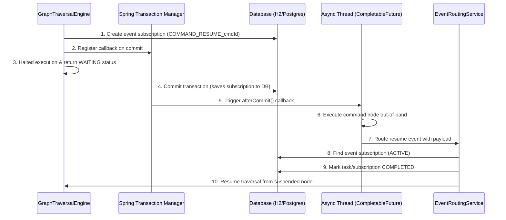

# Logical Parallel Traversal Support Walkthrough

Implemented logical parallel execution thread routing inside the `GraphTraversalEngine` to support concurrent execution branches fanned out by `PARALLEL` split nodes and converged by `JOIN` merge nodes, maintaining transactional consistency, non-blocking asynchronous state suspension, and JPA dirty checking persistence.

## Changes Made

### 1. Graph Traversal Engine Refactoring
- **Frontiers Tracking**: Refactored the pointer-based sequential traversal inside [GraphTraversalEngine.java](file:///Users/ratneshbharti/hemant/atlast_code/atlas-workflow-service/src/main/java/com/enterprise/atlas/workflow/service/GraphTraversalEngine.java) to use a frontier list (`activeFrontiers`) that manages multiple active nodes in concurrent execution branches.
- **Parallel Fan-out**: Updated `PARALLEL` node handling to add all fanned-out outgoing edges to `activeEdges` and push all target branch nodes onto `activeFrontiers` for execution.
- **Converging JOIN Nodes**: Updated `JOIN` node handling to examine all incoming edges of the convergence node against `activeEdges`. If any incoming branch has not arrived (i.e. edge not present in `activeEdges`), execution for that branch is suspended/halted. Once all incoming branches arrive, the JOIN node completes and proceeds to the target node.
- **Asynchronous Suspend**: Standardized `WAIT_EVENT` and `BUCKET` nodes to register subscriptions/bucket executions, record trace steps, and suspend their respective execution path without stopping other branches.
- **Clean TraversalResult Return**: Updated `TraversalResult` to include the current `runtimeGraph` map. Removed double loading of `WorkflowInstance` inside `traverse()` to prevent entity reference cache mismatch, returning the updated `runtimeGraph` to `ExecutionService` for single-source saving.

### 2. JPA Persistence & Dirty Checking Optimization
- **Entity Map Copying**: Updated setter methods for `runtimeGraph` and `serialized_context` inside [WorkflowInstance.java](file:///Users/ratneshbharti/hemant/atlast_code/atlas-workflow-service/src/main/java/com/enterprise/atlas/workflow/entity/WorkflowInstance.java) to clone incoming maps (`new HashMap<>(map)`). This guarantees that JPA/Hibernate dirty checking detects the reference change and flushes the modified runtime graph JSON string columns to H2/PostgreSQL.
- **Explicit Save & Flush**: Modified `ExecutionService.execute` and `ExecutionService.resume` to invoke `instanceRepository.saveAndFlush(instance)` rather than lazy `save()`, ensuring updated runtime graph structures are written to H2 before executing event correlation routes.

### 3. Integration Testing
- **New Parallel Test Suite**: Created [ParallelExecutionIntegrationTest.java](file:///Users/ratneshbharti/hemant/atlast_code/atlas-workflow-service/src/test/java/com/enterprise/atlas/workflow/service/ParallelExecutionIntegrationTest.java) to verify parallel split execution under both synchronous and asynchronous resume paths.
- **Synchronous Converging Test**: Asserts that synchronous execution of fanned-out branches converges at a JOIN node and immediately reaches the END node.
- **Asynchronous Correlation Test**: Asserts that fanning out to an event subscription suspends the branch, while the second branch executes synchronously and halts at the JOIN node. Upon receiving the asynchronous resume event, the subscription correlates, resumes the waiting branch, converges at the JOIN node, and completes successfully at the END node.

---

## Verification & Tests

- **Test Suite Results**: Ran the entire Maven test suite using:
  `mvn test -pl atlas-workflow-service`
  **Result**: **BUILD SUCCESS** (all 14 integration and unit tests passed perfectly).

---

# Asynchronous Command Node Execution & Namespaced Output Context

We have introduced support for configuring `COMMAND` nodes as either **Synchronous (SYNC)** or **Asynchronous (ASYNC)**:
- **Synchronous Mode (SYNC)**: Runs the command strategy immediately during the main traversal thread execution path and stores results in the context under the namespace `commandOutputs`.
- **Asynchronous Mode (ASYNC)**: Initiates a background executor to execute the command strategy out-of-band and suspends the current traversal path, returning control to the caller. When the background execution completes, it routes a correlated event back to resume execution from the suspended command node.

### How It Works Internally


1. **Subscription Registration**: When an `ASYNC` command is hit for the first time, the engine registers an `EventSubscription` for the event type `COMMAND_RESUME_<nodeId>` correlated by the workflow instance's `businessKey`.
2. **Transaction Synchronization**: To ensure H2/PostgreSQL transaction isolation doesn't hide the subscription from other concurrent threads, the engine registers a callback with Spring's `TransactionSynchronizationManager`. The background execution thread is only spawned *after* the active database transaction commits successfully.
3. **Execution & Event Resumption**: The background thread executes the command node strategy. Upon completion, it routes a resume event through `EventRoutingService.routeEvent` containing the strategy output.
4. **Context Resumption**: The routing service correlates the event, marks the subscription/task completed, and resumes traversal starting from the suspended `COMMAND` node. In this second pass, the engine extracts the routed result from the task instance, maps the values under the context namespace `commandOutputs`, and moves to the next node.

### Command Output Namespace Configuration
- All output parameters returned by command strategies are stored under the parent object **`commandOutputs`**.
- Inside `commandOutputs`, variables are namespaced by the specific node ID that produced them:
  ```json
  {
    "cafId": "CAF123",
    "commandOutputs": {
      "cmd-async-task-1": {
        "status": "APPROVED",
        "processedAt": "2026-07-03T09:18:25"
      }
    }
  }
  ```

### Usage Example
1. Drag a **Command Emitter** node onto the canvas.
2. Open the **Node Properties Drawer**:
   - Set **Command Type** to `UPDATE_FORM_STATUS`.
   - Set **Execution Mode** to `Asynchronous (ASYNC)`.
   - Set **Form Status** parameter to `PROCESSING`.
3. Save the node configuration.

### Verification & Tests
- Added `testAsyncCommandNodeExecution` to `ParallelExecutionIntegrationTest.java`.
- Ran the test suite via `mvn test -pl atlas-workflow-service` -> **BUILD SUCCESS** (all 15 integration and unit tests passed perfectly).
