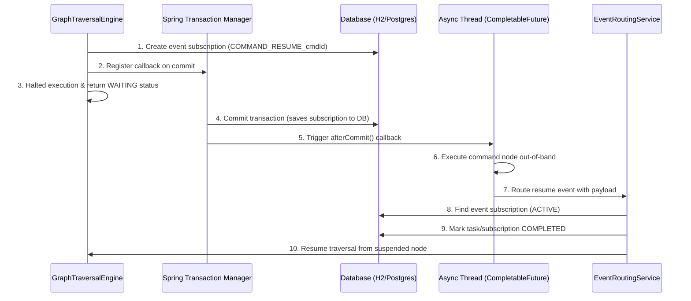

# Logical Parallel & Asynchronous Command Traversal Walkthrough

Implemented logical parallel execution thread routing inside the `GraphTraversalEngine` to support concurrent execution branches fanned out by `PARALLEL` split nodes and converged by `JOIN` merge nodes, maintaining transactional consistency, non-blocking asynchronous state suspension, and JPA dirty checking persistence.

---

## 1. Asynchronous Command Node Execution Mechanics

We have introduced support for configuring `COMMAND` nodes as either **Synchronous (SYNC)** or **Asynchronous (ASYNC)**:
- **Synchronous Mode (SYNC)**: Runs the command strategy immediately during the main traversal thread execution path and stores results in the context under the new namespace `commandOutputs`.
- **Asynchronous Mode (ASYNC)**: Initiates a background executor to execute the command strategy out-of-band and suspends the current traversal path, returning control to the caller. When the background execution completes, it routes a correlated event back to resume execution from the suspended command node.

### How It Works Internally


1. **Subscription Registration**: When an `ASYNC` command is hit for the first time, the engine registers an `EventSubscription` for the event type `COMMAND_RESUME_<nodeId>` correlated by the workflow instance's `businessKey`.
2. **Transaction Synchronization**: To ensure H2/PostgreSQL transaction isolation doesn't hide the subscription from other concurrent threads, the engine registers a callback with Spring's `TransactionSynchronizationManager`. The background execution thread is only spawned *after* the active database transaction commits successfully.
3. **Execution & Event Resumption**: The background thread executes the command node strategy. Upon completion, it routes a resume event through `EventRoutingService.routeEvent` containing the strategy output.
4. **Context Resumption**: The routing service correlates the event, marks the subscription/task completed, and resumes traversal starting from the suspended `COMMAND` node. In this second pass, the engine extracts the routed result from the task instance, maps the values under the context namespace `commandOutputs`, and moves to the next node.

---

## 2. Command Output Namespace Configuration

To prevent variable collisions inside the global workflow context:
- All output parameters returned by command strategies are stored under a dedicated parent object named **`commandOutputs`**.
- Inside `commandOutputs`, variables are namespaced by the specific node ID that produced them:
  ```json
  {
    "cafId": "CAF123",
    "commandOutputs": {
      "cmd-async-task-1": {
        "status": "APPROVED",
        "processedAt": "2026-07-03T09:18:25"
      }
    }
  }
  ```
- If the node has explicit `outputMapping` parameters, specific nested parameters are also mapped directly to the root of the context as configured by the user.

---

## 3. Usage Example

### Canvas UI Configuration
1. Drag a **Command Emitter** node onto the canvas.
2. Open the **Node Properties Drawer**:
   - Set **Command Type** to `UPDATE_FORM_STATUS`.
   - Set **Execution Mode** to `Asynchronous (ASYNC)`.
   - Set **Form Status** parameter to `PROCESSING`.
3. Save the node configuration.

### Internal Graph Representation
```json
{
  "id": "cmd-node-01",
  "type": "COMMAND",
  "label": "Process Request",
  "data": {
    "commandType": "UPDATE_FORM_STATUS",
    "formStatus": "PROCESSING",
    "executionMode": "ASYNC"
  }
}
```

---

## 4. Verification & Tests

- **Test Suite Results**: Verified via [ParallelExecutionIntegrationTest.java](file:///Users/ratneshbharti/hemant/atlast_code/atlas-workflow-service/src/test/java/com/enterprise/atlas/workflow/service/ParallelExecutionIntegrationTest.java):
  - `testLogicalParallelSplitSynchronousResume` -> PASS
  - `testLogicalParallelSplitAsynchronousResume` -> PASS
  - `testAsyncCommandNodeExecution` -> PASS
  `mvn test -pl atlas-workflow-service`
  **Result**: **BUILD SUCCESS** (all 15 integration and unit tests passed perfectly).
