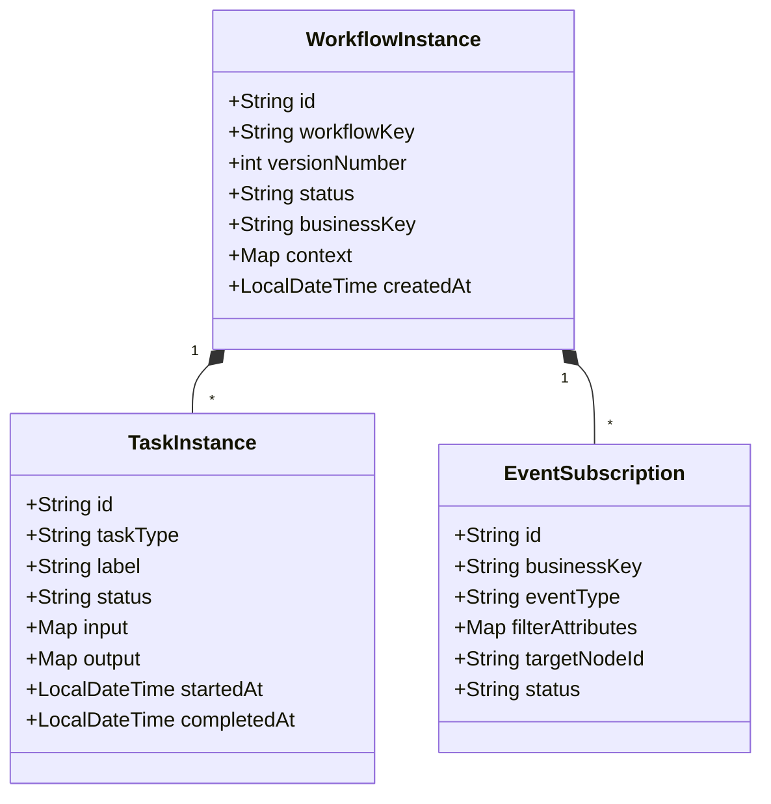
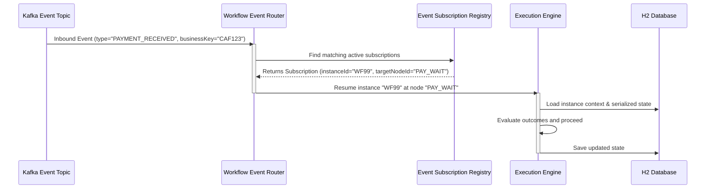

# Architecture Review & Evolution Proposal
## Next-Gen Event-Driven Workflow Engine

This document provides a comprehensive architectural proposal to evolve the workflow engine from its current **Bucket-centric** model into a highly extensible, **event-driven, contract-based Task/Activity orchestration engine**.

---

## 1. Core Runtime Abstractions

To support diverse async patterns (e.g. fraud checks, payment gates, child workflows) without code changes, we generalize execution into three primary abstractions:



*   **`WorkflowInstance`**: The root execution state record, containing context variables, execution status, and a unique **Business Key** (e.g., `CAF_ID`, `MSISDN`).
*   **`TaskInstance`** (replacing `BucketExecution`): Represents any work unit. A task can be:
    *   *Synchronous*: Evaluated immediately (e.g., executing a rule, mapping variables).
    *   *Asynchronous*: Suspends execution and transitions the engine into a wait-state.
*   **`EventSubscription`**: Declares that a workflow instance is waiting for a specific event type matching a set of attributes (correlated via the Business Key).

---

## 2. Asynchronous Work & Event Model

Instead of hardcoding `Bucket` logic, any task can declare it is asynchronous. The engine suspends execution and registers one or more event subscriptions.

### Hybrid Event Correlation Model
resumption correlates incoming events (from Kafka, REST, Webhooks, etc.) using:
$$\text{Correlation Key} = \text{Business Key} + \text{Event Type} + \text{Filter Attributes}$$



---

## 3. Child Workflow Model (Call Activities)

Child workflows are executed as fully isolated, independent service calls. This prevents tight coupling and enables reusability.

*   **Call Activity Node**: When the parent engine encounters a `SUB_WORKFLOW` task, it:
    1.  Resolves the child's definition version.
    2.  Creates a new, distinct `WorkflowInstance` representing the child, storing a pointer to the parent ID.
    3.  Evaluates the **Input Contract** and maps parent variables into the child's context.
    4.  Suspends the parent and registers an `EventSubscription` for the event `CHILD_WORKFLOW_COMPLETED` matching the child's instance ID.
*   **Outcome Propagation**: When the child completes, it fires a `CHILD_WORKFLOW_COMPLETED` event containing its **Output Contract** payload. The parent is resumed, maps the outputs back, and evaluates rules.

---

## 4. Context Mapping & Service Contracts

To prevent scope creep, namespace collisions, and side-effects, workflows treat each other as sandboxed APIs using explicit contracts:

```
+-------------------------------------------------------------+
| Parent Context:                                             |
| { "cafId": "CAF123", "age": 22, "dealerId": "D100" }        |
+-------------------------------------------------------------+
                              |
                     [ Input Mapping ] 
               e.g. { "cafId": context.cafId }
                              |
                              v
+-------------------------------------------------------------+
| Child Input:                                                |
| { "cafId": "CAF123" }  <-- Enforces Child Input Contract    |
+-------------------------------------------------------------+
                              |
                      [ Child Executes ]
                              |
                              v
+-------------------------------------------------------------+
| Child Output:                                               |
| { "result": "APPROVED", "riskScore": 12 }                   |
+-------------------------------------------------------------+
                              |
                    [ Output Mapping ]
            e.g. { "POLICE_RESULT": outcome.result }
                              |
                              v
+-------------------------------------------------------------+
| Parent Context Updated:                                     |
| { ..., "POLICE_RESULT": "APPROVED" }                        |
+-------------------------------------------------------------+
```

---

## 5. Dynamic Graph Generation (Map/Fork Expansion)

Workflows remain declarative for readability, but support dynamic parallel execution paths (similar to a Map state or dynamic loop).

*   **Map/Fork Node**: Expands dynamically at runtime based on an array in the context.
    *   *Example*: If context contains `requiredVerifications: ["police", "fraud", "credit"]`, a single Map node expands into three parallel child/activity tasks.
*   **Join Aggregator**: Gathers the outcomes of all dynamically generated branches and merges them into a collective list before proceeding.

---

## 6. Observability & Explainability Strategy

To satisfy transaction-level traceability ("Why did it happen?"), we implement **Event-Sourced Step Auditing**:

```json
{
  "instanceId": "WF_99",
  "stepIndex": 5,
  "nodeId": "RULE_RISK_CHECK",
  "nodeType": "RULE",
  "status": "EVALUATED",
  "evaluatedExpression": "context.riskScore > 10",
  "expressionResult": true,
  "contextSnapshot": {
    "cafId": "CAF123",
    "riskScore": 12
  },
  "timestamp": "2026-06-15T18:00:00Z"
}
```

*   **No State Drifts**: Because every step records its absolute inputs, evaluated rules, and output variables, the audit timeline is static and explainable, even if the workflow definition changes.

---

## 7. Replay & Debugging Strategy

To enable developers to reproduce bugs and simulate changes, we support **Deterministic Event-Log Replay**:

1.  **Re-traversal**: The engine re-executes the graph from the start node using the initial input context.
2.  **Mock Interception**: When the engine hits a `TASK`, `SUB_WORKFLOW`, or `API` node, it retrieves the outcome recorded in the step audit log rather than running the task or calling the live API.
3.  **Dynamic Rule Evaluation**: Rules and conditional edges are evaluated *live*.
    *   *Result*: Developers can modify a rule's SpEL expression, replay the transaction, and visually watch where the execution path diverges (Time-Travel Debugging).

---

## 8. Long-Term Extensibility Considerations

*   **Database Schema Separation**: Keep execution state, event subscriptions, and transaction logs in separate database tables. This scales read performance on dashboard queries.
*   **State-Machine Pure Engine**: The traversal engine should only handle state mapping, traversal, and contract validation. Execution of tasks (e.g. posting to Kafka, calling REST APIs) should be delegated to async workers or pluggable task executors to keep the core thread lightweight.

---

## 9. Implemented Runtime Execution Graph

To separate the static *Workflow Definition Graph* from the transaction-specific *Runtime Execution Graph*, we have implemented path-specific persistence:

1.  **Persistence**: The `WorkflowInstance` entity stores a `runtimeGraph` (`Map<String, Object>`) column converted via `GenericJsonConverter.MapConverter.class` into a CLOB. This graph contains exactly the list of `nodes` and `edges` that have been executed.
2.  **Dynamic Construction**: Whenever a node is executed, the engine converts and appends the node representation to the instance's active `nodes` collection. It also matches and logs any incoming edges from parent nodes that have completed.
3.  **Visualization & Inspection**: In replay mode, the frontend `ExecutionReplayPage` fetches the instance's `runtimeGraph` and passes it to the `DesignerCanvas` component. The canvas prioritizes rendering this sub-graph over the static version definition, visually isolating the active execution path.

---

## 10. Implemented Activation-Based Runtime

We introduced a reactive, condition-based evaluation loop in `GraphTraversalEngine.java` to support dynamic activation-based workflows alongside standard sequential pointer-based traversal.

### Node Activation Abstraction
Nodes can define an optional `activationCondition` (a SpEL expression evaluated against the context map):
```json
{
  "nodeId": "OBCC_TASK",
  "type": "BUCKET",
  "data": {
    "activationCondition": "context.A2_STATUS == 'APPROVED' && context.PREMIUM_STATUS == 'APPROVED'"
  }
}
```

### The Reactive Activation Loop
If the traversal engine detects `activationCondition` metadata on nodes, it activates the reactive traversal loop:
1.  **Start Hook**: It initiates execution with the `START` node.
2.  **Scan Loop**: It repeatedly scans for inactive nodes in the definition graph.
3.  **SpEL Evaluation**: For each inactive node:
    *   If it has an `activationCondition`, it evaluates the SpEL expression. If `true`, the node is activated.
    *   If it has no condition, it activates automatically if at least one of its predecessor source nodes has completed.
4.  **Suspension & Persistence**: If a node of type `BUCKET` is activated, execution suspends, and the instance enters a `WAITING` state. The accumulated `runtimeGraph` is saved to the database.
5.  **Resumption**: Upon resumption (e.g. manual task approval), the engine resumes at the suspended node, evaluates downstream conditions with the updated context, and triggers the next wave of reactive activations.

