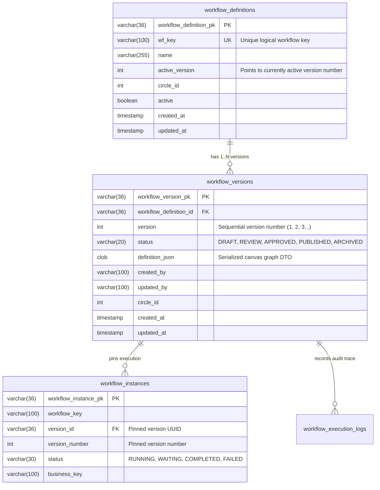
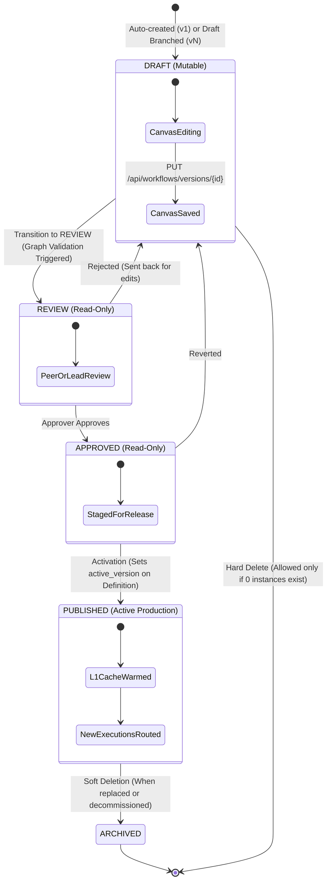
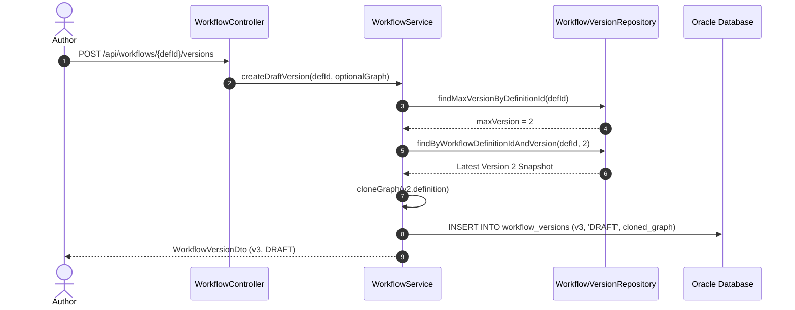
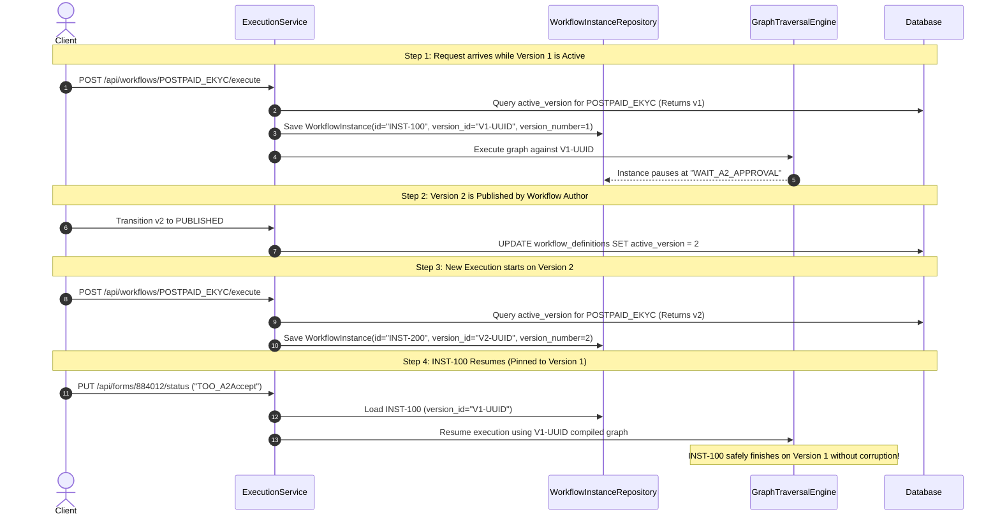

# Atlas Workflow Engine: Version Management Guide

This document details the architectural design, lifecycle governance, database persistence, and runtime execution isolation for workflow versioning within the Atlas State Machine & Workflow Engine.

---

## 1. Architectural Overview & Data Model

Atlas separates top-level workflow catalog declarations from their specific versioned implementations using a **Header-to-Snapshot** design pattern.

- **Workflow Definition (Header)**: Represents the logical workflow identity (e.g., `POSTPAID_EKYC`), its tenant/circle affiliation, and points to the currently active production version (`active_version`).
- **Workflow Version (Snapshot)**: An immutable capture of the canvas graph (nodes, edges, expressions, visual coordinates) along with governance metadata (`status`, `author`, `timestamps`).

### Entity Relationship Model



---

## 2. Version Lifecycle & Governance State Machine

Workflow definitions adhere to an audited four-stage lifecycle designed to prevent unvalidated changes from impacting production execution.



### Lifecycle Gate Rules

| Status | Mutability | Allowed Transitions | Triggered Actions / Validations |
| :--- | :--- | :--- | :--- |
| **`DRAFT`** | **Mutable** | `REVIEW`, (Hard Delete) | Canvas graph can be updated. Cannot be executed in production. |
| **`REVIEW`** | **Immutable** | `APPROVED`, `DRAFT` | Executes `validateWorkflowGraph()`: verifies all wait events match registered Kafka schemas, command configurations, and bucket outcomes. |
| **`APPROVED`** | **Immutable** | `PUBLISHED`, `DRAFT` | Staged for production rollout. |
| **`PUBLISHED`** | **Immutable** | `ARCHIVED` | Updates `workflow_definitions.active_version`. Pre-warms AOT SpEL bytecode and $O(1)$ adjacency graph cache in Caffeine L1 cache. |
| **`ARCHIVED`** | **Immutable** | None | Retained for auditability of historical and long-running instances. |

> [!IMPORTANT]
> **No Direct Publish**: Transitioning directly from `DRAFT` to `PUBLISHED` is strictly blocked by the engine. All changes must pass through `REVIEW` and `APPROVED` gates.

---

## 3. Version Creation & Auto-Cloning Strategy

When engineers modify or evolve an existing production workflow:
1. The engine looks up the highest assigned version number:
   $$\text{nextVersion} = \max(\text{version}) + 1$$
2. A new `WorkflowVersion` is generated in `DRAFT` status.
3. **Deep-Cloning**: If the author does not provide a blank graph, the engine deep-clones the canvas topology (all nodes, coordinates, decision expressions, and connecting edges) from the previous version. The engineer can then iterate incrementally without recreating nodes.



---

## 4. In-Flight Execution Isolation & Version Pinning

Enterprise workflows in Atlas often span days or weeks (e.g., waiting for manual document verification, biometric approval buckets, or external callbacks). 

When a new workflow version is published, **in-flight instances must continue on their original version** to prevent structural inconsistencies, missing state nodes, or schema mismatches.



---

## 5. AOT Graph Compilation & L1 Caffeine Caching

Atlas uses `WorkflowGraphCompiler` to eliminate graph interpretation overhead during high-concurrency execution:

1. **Ahead-of-Time SpEL Compilation**: All rule node expressions and conditional edge predicates are parsed and compiled into JVM bytecode via Spring's `SpelCompilerMode.IMMEDIATE`.
2. **$O(1)$ Adjacency Lookups**: Topologically pre-indexes incoming/outgoing edges and node maps into immutable memory structures.
3. **Cluster Invalidation & Pre-Warming**:
   - Updating a draft automatically invalidates any stale compiled graph in the local Caffeine L1 cache.
   - Promoting a version to `PUBLISHED` triggers **ahead-of-time pre-warming**, ensuring that the very first live execution has sub-millisecond dispatch latency.

```mermaid
flowchart LR
    A[WorkflowVersion.definition_json] --> B[WorkflowGraphCompiler]
    B --> C[SpEL Bytecode Compilation]
    B --> D[O(1) Adjacency Indexing]
    C --> E[CompiledWorkflowGraph]
    D --> E
    E --> F[(Caffeine L1 Cache)]
    F --> G[GraphTraversalEngine Runtime Execution]
```

---

## 6. Deletion Protection & Historical Archiving

To maintain strict regulatory compliance and audit trails:

- **Active Version Protection**: A `PUBLISHED` version cannot be deleted.
- **Referential Integrity Protection**:
  - The engine checks `workflowInstanceRepository.countByWorkflowVersionId(versionId)`.
  - If instances exist ($\text{count} > 0$), the version **cannot be hard-deleted**. It is automatically transitioned to `ARCHIVED`.
  - Only unexecuted `DRAFT` versions with 0 historical instances can be purged from the database.

---

## 7. Version Management REST API Reference

| Method | Endpoint | Description |
| :--- | :--- | :--- |
| `GET` | `/api/workflows/{id}` | Retrieves workflow definition and list of all its version summaries. |
| `POST` | `/api/workflows/{id}/versions` | Branches a new `DRAFT` version (`maxVersion + 1`), auto-cloning graph from the latest version. |
| `GET` | `/api/workflows/versions/{versionId}` | Retrieves complete graph topology and layout details for a version. |
| `PUT` | `/api/workflows/versions/{versionId}` | Saves/updates canvas graph (Allowed only when `status == 'DRAFT'`). |
| `PUT` | `/api/workflows/versions/{versionId}/status` | Transitions version through governance gates (`DRAFT` $\rightarrow$ `REVIEW` $\rightarrow$ `APPROVED` $\rightarrow$ `PUBLISHED`). |
| `GET` | `/api/workflows/active/{workflowKey}` | Fetches currently published version for execution inspection. |
| `DELETE` | `/api/workflows/versions/{versionId}` | Hard-deletes unused drafts or archives versions that have historical executions. |
